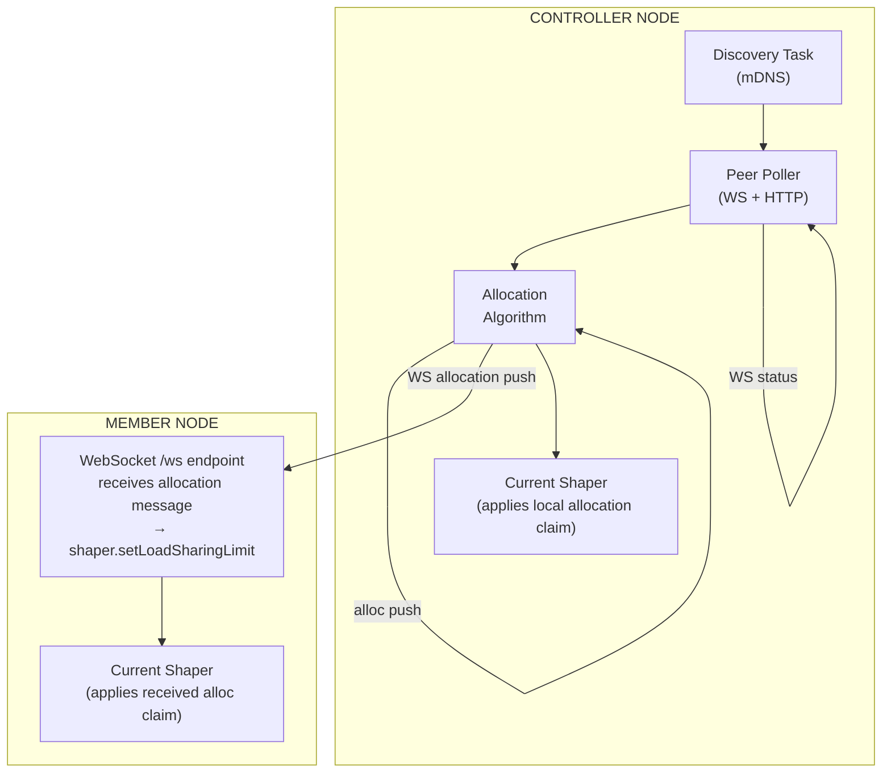
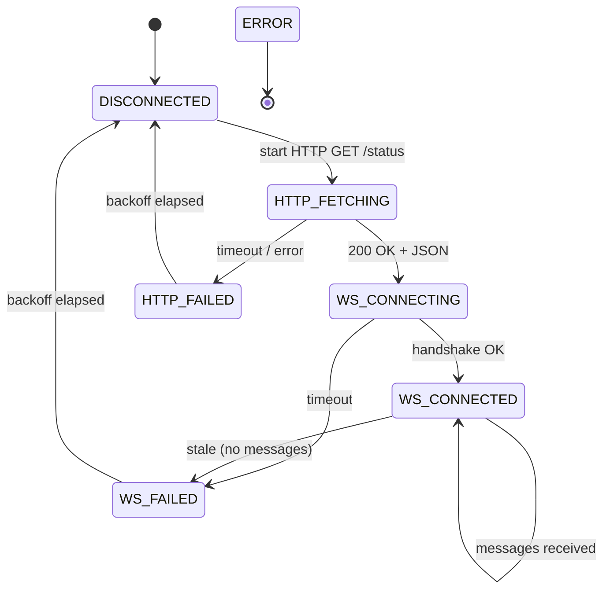

# Load Sharing — Theory of Operation

> This document describes the intended behaviour of the load sharing feature at
> a level of detail suitable for validating the implementation and writing
> tests.  It is **normative**: where the code diverges from this document, one
> or the other must be corrected.
>
> Branch: `jeremypoulter/issue940`
> Last updated: 2026-07-15
> Includes: [#1147](https://github.com/OpenEVSE/openevse_esp32_firmware/pull/1147) member failsafe, priority, rotation

---

## 1  Purpose

Load sharing allows 2–8 OpenEVSE chargers on the same LAN to share a single
upstream circuit breaker limit.  No cloud service, MQTT broker, or external
controller is required.

## 2  Terminology

| Term | Definition |
|------|-----------|
| **Node** | One OpenEVSE ESP32 WiFi gateway. |
| **Group** | A set of nodes that share a common upstream current limit. |
| **Controller** | The node where the user configures load sharing. Runs the allocation algorithm, pushes current limits to members. |
| **Member** | A node that receives its load sharing configuration and current allocation from the controller. Config is read-only. |
| **Peer** | Any other node on the LAN, discovered or manually configured. |
| **Idle** | No vehicle is connected (EVSE state A or equivalent). Allocation reason `idle`, target 0 A. |
| **Connected** | A node whose vehicle is connected but not drawing current (EVSE state B). |
| **Charging** | A node whose vehicle is actively drawing current (EVSE state C). |
| **Demanding** | Allocator input for an online node with a connected vehicle that is not idle, sleeping, or disabled (states B or C). Only `charging` nodes consume the shared budget. |
| **Connected min** | `min(min_current, max_current)` offered to a state-B node outside the shared budget. Its physical draw is 0 A. |
| **Physical draw** | Measured EV current. INV-1 applies to the sum of physical draws. |
| **Offered allocation** | The allocator's `target_current`. It may exceed physical draw during taper or for `connected_min`. |
| **Pilot demand** | Current available from the pilot signal. It is not the measurement used for INV-1. |
| **Claim** | An entry in the `EvseManager` claim system that constrains the EVSE's pilot signal. |
| **Shaper** | The `CurrentShaperTask` which manages the `EvseClient_OpenEVSE_Shaper` claim and integrates load sharing limits. |

## 3  Architecture Overview



### 3.1  Key Design Decisions

1. **Controller/member model** — one device is the single source of truth;
   eliminates distributed consensus.
2. **Allocation via Current Shaper** — load sharing limits are applied through
   the existing `EvseClient_OpenEVSE_Shaper` claim at `EvseManager_Priority_Safety`,
   re-using the shaper's failsafe timeout and pause timer logic.
3. **WebSocket reuse** — the controller connects to each member's existing `/ws`
   endpoint for status ingestion. It also sends allocation commands *back*
   through the same WebSocket connections from the controller side.
4. **No new claim client** — although `EvseClient_OpenEVSE_LoadSharing` (0x0001000E /
   65550) is defined in `evse_man.h`, the actual enforcement goes through the
   shaper's `_loadshare_limit_active` flag on the existing shaper claim rather
   than creating a separate claim.

---

## 4  Component Details

### 4.1  Configuration

Configuration is stored via `ConfigJson` and exposed on the `/config` endpoint.

| Key | Type | Default | Description |
|-----|------|---------|-------------|
| `loadsharing_enabled` | bool | `false` | Master enable. |
| `loadsharing_role` | string | `""` | `""`, `"controller"`, or `"member"`. |
| `loadsharing_controller_host` | string | `""` | Member only: hostname of the controller. |
| `loadsharing_group_id` | string | `""` | User-defined group identifier. |
| `loadsharing_group_max_current` | double | `0` | Total circuit limit (amps). |
| `loadsharing_safety_factor` | double | `1.0` | De-rating multiplier `[0..1]`. |
| `loadsharing_heartbeat_timeout` | int | `30` | Seconds; min 5. Allocation heartbeat timeout used for member failsafe and controller peer-offline detection. |
| `loadsharing_failsafe_mode` | string | `"safe_current"` | `"safe_current"` or `"disable"`. |
| `loadsharing_failsafe_safe_current` | double | `6.0` | Amps; used in safe_current mode. MUST be ≤ `loadsharing_group_max_current`. |
| `loadsharing_failsafe_peer_assumed_current` | double | `6.0` | Amps; offline peer reserve. |
| `loadsharing_priority` | int | `0` | Node priority (lower = higher); NOT synced. |
| `loadsharing_rotation_interval` | uint | `1800` | Seconds; under scarcity, rotate equal-priority winners. `0` disables. |

> **Invariant**: On a member device (`loadsharing_role == "member"`), load
> sharing configuration fields MUST be read-only.  POST/DELETE to
> `/loadsharing/peers` MUST return HTTP 403.
>
> **Invariant**: `POST /config` MUST reject writes where
> `loadsharing_failsafe_safe_current > loadsharing_group_max_current` (using
> incoming values when present, otherwise stored values).  Role transitions
> (`becomeMember()` / `resetRole()`) MUST run only after all validation
> succeeds.

### 4.2  Peer List Persistence

- Group peers are stored in `/loadsharing_peers.json` on LittleFS as a JSON
  array of hostnames: `{"peers": ["openevse-1.local", "192.168.1.100"]}`.
- Writes use an atomic temp-file-then-rename pattern
  (`/loadsharing_peers.json.tmp` → `/loadsharing_peers.json`).
- On boot, `LoadSharingGroupState::loadGroupPeers()` reads the file.  If the
  file is missing or corrupt, the group starts with an empty peer list
  (graceful degradation).
- Each `addGroupPeer()` / `removeGroupPeer()` call sets a dirty flag and
  immediately persists.

### 4.3  Discovery (`LoadSharingDiscoveryTask`)

- Background `MicroTasks::Task` performing periodic mDNS queries for
  `_openevse._tcp`.
- Query interval: ~60 seconds (configurable).  Task wakes every 2 seconds to
  check if a query should start.
- Results are cached with a TTL.  `POST /loadsharing/discover` resets the
  timer for an immediate re-query.
- Discovered peers are deduplicated by hostname (same device on multiple
  network interfaces).
- After each query completes, `LoadSharingGroupState::onDiscoveryComplete()`
  updates peer online/offline flags and IP addresses.

> **Invariant**: Discovery MUST NOT block the HTTP server thread.  All queries
> run asynchronously.

### 4.4  Peer Poller (`LoadSharingPeerPoller`)

The peer poller is a `MicroTasks::Task` that maintains connections to all
group peers.  It wakes every 500 ms.

#### 4.4.1  Connection State Machine



**States**:

| State | Entry action | Transition out |
|-------|-------------|----------------|
| `DISCONNECTED` | Start HTTP GET `/status` | → `HTTP_FETCHING` |
| `HTTP_FETCHING` | Async HTTP in flight | Success → `WS_CONNECTING`; timeout/error → `HTTP_FAILED` |
| `HTTP_FAILED` | Wait for backoff delay | Delay elapsed → `DISCONNECTED` |
| `WS_CONNECTING` | Allocate `MongooseWebSocketClient`, connect to `ws://{host}/ws` | Open callback → `WS_CONNECTED`; timeout → `WS_FAILED` |
| `WS_CONNECTED` | Process messages, monitor heartbeat | Stale → `WS_FAILED`; close event → `WS_FAILED` |
| `WS_FAILED` | Wait for backoff delay | Delay elapsed → `DISCONNECTED` |
| `ERROR` | Terminal | (none) |

**Reconnection**: Exponential backoff — `delay = min(1000ms × 2^retryCount, 60000ms)`.  Retry counter resets on successful connection.

#### 4.4.2  HTTP Bootstrap

- `GET http://{peer}/status` — async request via `MongooseHttpClient`.
- Parses JSON response for: `amp`, `voltage`, `pilot`, `vehicle`, `state`,
  `config_version`, `config_hash`.
- Populates `PeerConnection.statusCache`.
- Sets `hasInitialStatus = true`.
- Timeout: `_http_timeout_ms` (default 10 000 ms).

#### 4.4.3  WebSocket Status Ingestion

- Connects to `ws://{peer}/ws`.
- On connect: member sends full status document (existing firmware behaviour).
- Subsequent messages: delta updates (only changed fields).
- Parsed fields merged into `statusCache` via key-by-key overwrite.
- `lastMessageTime` updated on every received message.
- PING/PONG interval: 15 s.  Stale timeout: 30 s.

#### 4.4.4  Config Push to Members (Controller Only)

- After a peer reaches `WS_CONNECTED` for the first time, the controller sends
  `POST http://{member}/config` with all group-level load sharing config fields
  plus `loadsharing_role: "member"` and `loadsharing_controller_host: {self}`.
- `pushConfigToAllPeers()` sets a `_configPushPending` flag; on the next loop
  iteration, all connected peers have their `configPushed` flag cleared and
  config is re-sent.
- On peer removal (`DELETE /loadsharing/peers/{host}`), a reset config is
  pushed: `{loadsharing_enabled: false, loadsharing_role: ""}`.

### 4.5  Reciprocal Peer Sync

When a peer is added via `POST /loadsharing/peers` on the controller, a
reciprocal `POST /loadsharing/peers` (with `reciprocal: false` to prevent
infinite loops) is sent to the remote peer, adding the local device on the
remote's group list.  The same pattern applies to `DELETE`.

> **Invariant**: Reciprocal requests MUST include `reciprocal: false` (POST body)
> or `?reciprocal=false` (DELETE query string) to prevent ping-pong loops.

---

## 5  Allocation Algorithm

File: [loadsharing_algorithm.cpp](src/loadsharing_algorithm.cpp)

The algorithm is **"Equal Share with Minimums"**, executed on the controller
every 5 seconds (or when triggered by status changes).

### 5.1  Inputs

For each member `i` (including the controller itself):

- `online_i` — boolean: peer has active WebSocket (controller is always online).
- `demanding_i` — boolean: vehicle connected AND actively charging (state C).
- `charging_i` — boolean: state C specifically.
- `min_current_i` — EVSE minimum (amps).
- `max_current_i` — EVSE maximum, possibly capped when measured current is below pilot.
- `priority_i` — integer (lower = higher).

Group level:

- `I_group = group_max_current × safety_factor`
- `failsafe_peer_assumed_current`
- `failsafe_mode` (`"safe_current"` or `"disable"`)
- `rotation_interval_ms` (0 disables rotation)
- `rotation` state persisted across calls (`offset`, `initialized`, `last_rotation_ms`)
- `now_ms` (firmware `millis()` or simulator time)

### 5.2  Algorithm Steps

1. INITIALISE: Create result vector; set all allocations to 0, reason "idle".

2. OFFLINE CHECK (disable mode):
   IF any member is offline AND failsafe_mode == "disable":
     → Set ALL allocations to 0, reason "failsafe_disabled".
     → Set failsafe_active = true.
     → RETURN.

3. OFFLINE RESERVE (safe_current mode):
   offline_reserve = count(offline members) × failsafe_peer_assumed_current
   IF offline_reserve > 0: failsafe_active = true.

4. COMPUTE AVAILABLE:
   I_avail = max(0, I_group − offline_reserve)

5. CLASSIFY MEMBERS:
   For each online, demanding member:
     IF charging (state C): add to demanding_indices.
     ELSE (connected, state B): allocate connected_min = min(min_i, max_i),
       reason "connected_min".  This allocation is OUTSIDE the shared budget
       (an EV in state B draws 0 A physically).

6. IF demanding_indices is empty: RETURN (only connected_min allocations if any).

7. SORT demanding members by priority ascending (lower value = higher priority),
   then by device ID for a deterministic order within equal priority.

8. UNDER SCARCITY ROTATION (only when later steps will take the insufficient
   path; harmless under ample budget because equal-share is order-insensitive):
   IF `rotation_interval_ms > 0` AND more than one demanding member:
     - First call: seed `last_rotation_ms = now_ms` (`initialized = true`);
       do not advance offset.
     - Else IF `(now_ms - last_rotation_ms) >= rotation_interval_ms`:
       advance `offset`, update `last_rotation_ms`.
     - For each contiguous equal-priority run in the sorted list, rotate the
       run left by `offset % run_length`.

9. SUM MINIMUMS:
   total_min = Σ min(min_i, max_i) for i in demanding.

10. IF I_avail ≥ total_min (sufficient capacity):
   a. Assign each demanding member: alloc_i = min(min_i, max_i).
   b. remainder = I_avail − total_min.
   c. Iteratively distribute remainder equally among uncapped members:
      - share = remainder / |uncapped|
      - proposed = alloc_i + share
      - IF proposed > max_i: cap at max_i, add overshoot to leftover.
      - ELSE: accept proposed.
      - Repeat with leftover and still-uncapped members until leftover < 0.01.
   d. Set reason "equal_share" for all demanding members.

11. ELSE (insufficient capacity):
    Walk demanding members in sorted (and possibly rotated) order:
      IF budget ≥ min_i: allocate min_i, reason "min_subset", deduct from budget.
      ELSE: allocate 0, reason "insufficient".

12. MARK OFFLINE: For all offline members, override reason to "offline".

13. RETURN allocation vector.

### 5.3  Underutilized Demand Cap (`applyLoadSharingDemandCap`)

Before building allocation inputs, if more than one member is demanding, each
member's `max_current` is adjusted through a persistent
`LoadSharingDemandState` when the EV draws less than its last offered
allocation:

1. **Detect (immediate downward)**: if the pilot is above the member minimum and
   `measured_current < pilot_current − 0.25`, set `demand_cap = measured_current`
   and mark the state active. Detection is suppressed briefly after the offered
   allocation increases so ramp-up transients are not mistaken for a hard ceiling.
2. **Sticky cap**: while active, keep `effective_max = min(configured_max,
   demand_cap)` even when integer pilot quantization would clear a stateless
   `measured < pilot − 0.25` check on the next cycle.
3. **Recovery**: release the cap when measured current tracks the offered
   allocation again (`measured ≥ offered − 0.25` and `measured ≥ demand_cap −
   0.25`).
4. **Bounded probe**: every 6 allocation cycles (30 s at the 5 s cadence),
   sample whether measured current has risen above the capped ceiling. A probe
   does not bump the offered allocation; it only releases the cap when measured
   demand has genuinely recovered.
5. **Reset**: clear demand state when the member disconnects, leaves charging,
   or begins a new charging session.

This prevents over-allocating to a member whose EV is not using its full pilot
(taper, EV current limit, aux load, etc.), freeing budget for other members
without oscillating allocations every 5 s.

### 5.4  Connected-But-Not-Charging ("Connected Min")

A member in EVSE state B (vehicle connected, not drawing current) receives its
minimum allocation (`connected_min`) so the EV can start on demand.  This
allocation is **not deducted from the shared budget** because the EV draws 0 A
physically.  This is intentional bounded over-allocation (worst case: all
connected EVs start simultaneously, temporarily exceeding the budget by
`connected_count × min_current`).

> **Safety note**: The sum of connected_min allocations can exceed I_avail.
> This is acceptable because connected EVs draw no real current.  Once an EV
> begins charging (state C), the next allocation cycle accounts for it in the
> shared budget.

### 5.5  Allocation Delivery

**Controller → members (WebSocket)**:

```json
{"loadsharing": {"target_current": 16.5, "reason": "equal_share"}}
```

Sent via `MongooseWebSocketClient::sendTXT()` through the controller's
outgoing WebSocket connection to each member.

**Controller (self)**: Calls `shaper.setLoadSharingLimit(selfAllocation, ...)`.

**Member (receive)**: The member's `/ws` endpoint (`onWsFrame()` in
`web_server.cpp`) detects `doc["loadsharing"]["target_current"]` and calls
`shaper.setLoadSharingLimit(...)` or `shaper.clearLoadSharingLimit()`.

### 5.6  Allocation Enforcement (`CurrentShaperTask`)

Load sharing limits are applied through the **existing shaper claim**, not a
separate claim.  The shaper has three new fields:

| Field | Purpose |
|-------|---------|
| `_loadshare_limit_active` | Whether a load sharing limit is in effect. |
| `_loadshare_max_cur` | The load sharing target current (amps). |
| `_loadshare_force_disabled` | If true, the EVSE is set to `EvseState::Disabled`. |

**Integration logic** (in `CurrentShaperTask::loop()`):

1. **Shaper enabled**: `effective_max_cur = min(shaper_max_cur, loadshare_max_cur)`.
   The lower of the two limits wins.  If `_loadshare_force_disabled` is true or
   the effective current is below the EVSE minimum, the claim state is set to
   `Disabled`.
2. **Shaper disabled but load sharing active**: A standalone claim is created
   using only the load sharing limit.
3. **Both disabled**: The shaper claim is released.

> **Invariant**: The shaper claim uses `EvseManager_Priority_Safety`.  The
> combined shaper + load sharing limit MUST never exceed
> `group_max_current × safety_factor` across all members (excluding
> connected-but-not-charging over-allocation which is physically 0 A).

---

## 6  Failsafe Behaviour

### 6.1  Controller Failsafe (Member Offline)

When a member goes offline (no WebSocket messages within
`loadsharing_heartbeat_timeout`, default 30 s):

| Mode | Behaviour |
|------|-----------|
| `safe_current` | Reserve `failsafe_peer_assumed_current` (default 6 A) for each offline member. Remaining budget is shared among online demanding members. |
| `disable` | Set ALL allocations to 0 A.  All charging stops. |

**Invariant**: In `safe_current` mode, `I_avail = I_group − (offline_count × failsafe_peer_assumed_current)`.

### 6.2  Member Failsafe (Controller Offline)

On the member side, `LoadSharingGroupState::checkMemberFailsafe()` runs on
each poller loop iteration. Allocation receipt is authoritative: a fresh
allocation proves controller liveness even if mDNS discovery is stale. It sets
`_failsafe_active = true` when:

- `loadsharing_controller_host` is empty, OR
- No allocation has ever been received (`_last_allocation_received_ms == 0`), OR
- `millis() - _last_allocation_received_ms > heartbeat_timeout × 1000`.

When failsafe is active, `LoadSharingPeerPoller` MUST enforce it through the
same shaper load-sharing limit path used for allocations:

| Mode | Enforcement |
|------|-------------|
| `safe_current` | `shaper.setLoadSharingLimit(loadsharing_failsafe_safe_current)` |
| `disable` (or safe current ≤ 0) | `shaper.setLoadSharingLimit(0, force_disabled=true)` |

The shaper claim sits at `EvseManager_Priority_Safety`, so it outranks a
manual override while the member is islanded.  The failsafe limit is applied
once on engage (`_failsafeLimitApplied`); a mid-engagement change to
`loadsharing_failsafe_safe_current` takes effect on the next engage.  When
failsafe clears (fresh allocation received), the WebSocket allocation handler
replaces the limit and the poller clears `_failsafeLimitApplied`.

### 6.3  Controller Failure Recovery

If the controller goes offline:

1. Member failsafe engages within `loadsharing_heartbeat_timeout` (default 30 s)
   and applies the safe-current or disable limit (§6.2).
2. When a controller returns and resumes allocation pushes, the member applies
   the new allocation and clears the failsafe marker.
3. A permanently lost controller requires a new controller to be designated
   manually.

> **Invariant**: After controller loss, a member MUST NOT continue charging
> uncapped at a stale allocation.  Failsafe enforcement MUST engage within the
> heartbeat timeout.

---

## 7  REST API Surface

All endpoints are on the HTTP server (port 80).

| Method | Path | Controller | Member | Description |
|--------|------|-----------|--------|-------------|
| GET | `/loadsharing/peers` | ✅ List discovered + group peers | ✅ (read-only) | Returns JSON array with `id`, `name`, `host`, `ip`, `online`, `joined`. |
| POST | `/loadsharing/peers` | ✅ Add peer to group | ❌ 403 | Body: `{"host": "..."}`.  Returns `{"msg":"done"}`, or `200 {"msg":"already in group"}` if the peer is already joined (idempotent; skips reciprocal sync). |
| DELETE | `/loadsharing/peers/{host}` | ✅ Remove peer | ❌ 403 | Returns `{"msg":"done"}` or 404. |
| POST | `/loadsharing/discover` | ✅ Trigger mDNS query | ❌ (or 403) | Returns `{"msg":"done"}`. |
| GET | `/loadsharing/status` | ✅ Full group status | ✅ (own perspective) | Returns `LoadSharingStatus` (see below). |

### 7.1  `LoadSharingStatus` Response

```json
{
  "enabled": true,
  "group_id": "garage",
  "computed_at": "2026-07-13T08:30:00Z",
  "failsafe_active": false,
  "online_count": 2,
  "offline_count": 0,
  "peers": [
    {
      "id": "openevse_abc123",
      "name": "openevse-abc123.local",
      "host": "openevse-abc123.local",
      "ip": "192.168.1.101",
      "online": true,
      "joined": true,
      "version": "4.2.0",
      "last_seen": 12345,
      "status": {
        "amp": 16.5,
        "voltage": 240,
        "pilot": 32,
        "vehicle": 1,
        "state": 3
      }
    }
  ],
  "allocations": [
    {
      "id": "openevse-abc123.local",
      "target_current": 16.0,
      "reason": "equal_share"
    }
  ]
}
```

### 7.2  WebSocket Allocation Message

Sent from controller to member on existing `/ws` connection:

```json
{"loadsharing": {"target_current": 16.5, "reason": "equal_share"}}
```

Member receive handler in `web_server.cpp::onWsFrame()`:
- If `loadSharingGroupState.isMember()`:
  - Records allocation received timestamp.
  - Calls `shaper.setLoadSharingLimit(target_current, force_disabled)` for
    every allocation, including a 0 A allocation. `force_disabled` is true
    only for `failsafe_disabled`.

`clearLoadSharingLimit()` is reserved for disabling load sharing or clearing
the node's role. A zero allocation for an in-group member is an active safety
limit and MUST NOT clear the claim:

| Allocation | Enforcement |
|------------|-------------|
| `target_current > 0` | `setLoadSharingLimit(target_current, false)` |
| `target_current == 0`, reason `idle`, `offline`, or `insufficient` | `setLoadSharingLimit(0, false)` |
| `target_current == 0`, reason `failsafe_disabled` | `setLoadSharingLimit(0, true)` |
| Load sharing disabled or role cleared | `clearLoadSharingLimit()` |

---

## 8  Allocation Reasons

| Reason | Meaning |
|--------|---------|
| `idle` | Member is not demanding current (no vehicle or sleeping). |
| `equal_share` | Normal operation; budget shared equally among demanding members. |
| `connected_min` | Vehicle connected (state B) but not charging; minimum allocated outside budget. |
| `min_subset` | Insufficient budget; this member was selected (by priority, then ID, with optional rotation) to receive its minimum. |
| `insufficient` | Insufficient budget; this member was NOT selected to receive its minimum. |
| `offline` | Member is offline; reason is overridden regardless of allocation amount. |
| `failsafe_disabled` | Failsafe mode "disable" triggered; all members get 0 A. |

---

## 9  Timing Parameters

| Parameter | Default | Source | Notes |
|-----------|---------|--------|-------|
| Poller loop interval | 500 ms | `_poll_interval_ms` | How often the state machine advances. |
| Allocation recompute interval | 5 000 ms | Hardcoded in `loop()` | Controller recomputes on this cadence or on status change. |
| HTTP bootstrap timeout | 10 000 ms | `_http_timeout_ms` | Per-peer HTTP GET timeout. |
| WebSocket stale timeout | 30 000 ms | `_ws_stale_timeout_ms` | Close WS if no message for this long. |
| WebSocket PING interval | 15 000 ms | `_ws_ping_interval_ms` | PING/PONG keepalive. |
| Allocation heartbeat timeout | 30 s | `loadsharing_heartbeat_timeout` | Member failsafe and controller peer-offline detection. |
| Retry base interval | 1 000 ms | `_base_retry_interval_ms` | Exponential backoff base. |
| Retry max interval | 60 000 ms | `_max_retry_interval_ms` | Backoff cap. |
| Discovery interval | 60 s | Config/constant | mDNS query frequency. |
| Shaper failsafe timeout | 120 s | `current_shaper_data_maxinterval` | Shaper disables charge if no update. |
| Shaper min pause time | Config | `current_shaper_min_pause_time` | Minimum pause before re-enabling after undercurrent. |

### 9.1  Timer Roles

These timers are independent:

| Timer | Role |
|-------|------|
| Allocation heartbeat | User-facing liveness threshold. A member engages failsafe when controller allocations stop; a controller marks a peer offline when status stops. |
| WebSocket stale timeout | Transport-only timeout that closes a dead socket and starts reconnection. |
| Allocation recompute | Controller recalculates and pushes every 5 s; this is the INV-10 deadline. |
| WebSocket PING | Keepalive only. |
| Shaper failsafe | Protects stale CT-shaper data and is not a load-sharing group timer. |

---

## 10  Invariants and Safety Properties

These are the system-wide properties that MUST hold at all times.  They form
the basis for test assertions.

### 10.1  Current Budget Safety

> **INV-1**: The sum of all *physically drawn* currents across the group MUST
> NOT exceed `group_max_current × safety_factor` in steady state.
>
> Pilot demand and offered allocations are not physical-current measurements.
>
> Transient over-allocation is tolerable only for connected-but-not-charging
> members (which draw 0 A) and during the brief window (one allocation cycle,
> ≤5 s) after a member begins charging.

### 10.2  Allocation Completeness

> **INV-2**: Every group member (including the controller) MUST appear in the
> allocation result vector.  No member may be silently skipped.
>
> An empty member list or an unconfigured group (`group_max_current <= 0`)
> returns an empty result and is outside this invariant.

### 10.3  Priority-Aware Subset Selection

> **INV-3**: When the budget is insufficient for all minimums, members MUST be
> selected in priority order (lower value = higher priority), then device-ID
> order within equal priority.  With `loadsharing_rotation_interval > 0`,
> equal-priority runs MUST rotate on that interval so no equal-priority member
> is permanently starved.  For a fixed rotation state and inputs, the same
> allocation MUST be produced.

### 10.4  Offline Member Accounting

> **INV-4** (`safe_current` mode): For each offline member, `failsafe_peer_assumed_current`
> MUST be subtracted from the available budget before allocating to online members.
>
> **INV-5** (`disable` mode): If ANY configured member is offline, ALL
> allocations MUST be 0.

### 10.5  Failsafe Liveness

> **INV-6**: If the controller stops sending allocations to a member, the
> member MUST engage failsafe within `loadsharing_heartbeat_timeout` (default
> 30 s) and apply either `loadsharing_failsafe_safe_current` or a disabled
> charge state per `loadsharing_failsafe_mode`.  A manual override MUST NOT
> defeat this limit while failsafe is active.

### 10.6  Config Consistency

> **INV-7**: Member devices MUST reject local writes to load sharing config
> fields when `loadsharing_role == "member"`.

### 10.7  Reciprocal Sync

> **INV-8**: Adding peer A on controller B MUST trigger a reciprocal add of B
> on A (with `reciprocal: false`).  The converse holds for removal.

### 10.8  Persistence

> **INV-9**: The group peer list MUST survive device reboots.  After power
> cycle, `GET /loadsharing/peers` MUST return all previously added peers
> (with `joined: true`, `online` reflecting current discovery state).

### 10.9  Undrawn Pilot Redistribution

> **INV-10**: When a member's EV is drawing less than its pilot (for any
> reason — taper, EV current limit, aux load, etc.), the freed budget MUST be
> redistributed to other demanding members within one allocation cycle (≤5 s).

### 10.10  Allocation Stability

> **INV-STAB**: With unchanged group inputs (online set, EV states, measured
> currents, and configuration), consecutive allocation recomputations MUST NOT
> oscillate.
>
> A target MUST NOT move by more than 0.5 A and return within two consecutive
> 5 s recomputation cycles unless an input changed. Equal-priority scarcity
> winners may change only at a rotation boundary. During taper, the physical
> over-budget gap must converge without repeatedly changing sign. The one-cycle
> state-B to state-C exception in INV-1 still applies. The demand-cap tracker
> (`LoadSharingDemandState`) provides the hysteresis that enforces this against
> integer pilot quantization.

---

## 11  Simulation Framework

Simulation tests live in [divert_sim/test_loadsharing.py](divert_sim/test_loadsharing.py).
They call `run_loadsharing_simulation()` which exercises the allocation
algorithm using scenario JSON files from `divert_sim/data/scenarios/`.

### 11.1  Existing Validated Scenarios

| Scenario File | What It Tests | Key Assertions |
|---------------|--------------|----------------|
| `loadsharing_2peer_basic` | Equal split, 2 peers, 32 A | Each peer gets 16 A; supply not exceeded. |
| `loadsharing_variable_supply` | Time-varying supply limit | Available current tracks supply changes at t=0/1800/3600/5400. |
| `loadsharing_peer_offline` | Peer goes offline at t=1800 | Offline peer gets 0 A, reason "offline"; online peer gets >20 A. |
| `loadsharing_failsafe_disable` | Disable mode, peer offline | ALL allocations = 0 A when peer offline. |
| `loadsharing_ev_taper` | EV tapering to high SOC | EV reaches ≥99% SOC; SOC increases. |
| `loadsharing_ev_taper_redistribution` | Tapering EV frees budget | Total actual ≤32 A; peer 2 gets >16 A after peer 1 tapers. |
| `loadsharing_ev_delayed_start` | Connected EV starts late | t=0: state=connected, actual=0; t=600: state=charging, actual>0. |
| `loadsharing_ev_finish_aux_resume` | EV finishes then resumes | Finished EV goes to connected/0 A; at t=1800 resumes charging. |
| `loadsharing_connected_min_no_budget` | Connected min outside budget | Connected peer gets 6 A (connected_min), draws 0 A; charging peer gets >25 A. |
| `loadsharing_priority_wins` | Priority under scarcity | Higher-priority peer (lower value) wins min_subset over lower-id peer. |
| `loadsharing_scarcity_rotation` | Equal-priority rotation | Exactly one 6 A winner per tick; winner rotates every 1800 s. |

### 11.2  Additional Scenario Files (Not Yet Tested)

| File | Description |
|------|-------------|
| `loadsharing_3peer_staggered` | 3 peers with staggered vehicle connect times. |
| `loadsharing_insufficient` | Budget below total minimums — subset selection. |
| `loadsharing_ev_limited` | EV with limited max charge rate. |
| `loadsharing_longrun_2peer_handoff` | Long duration, peer handoff. |

---

## 12  Test Plan Summary

Tests should verify the invariants listed in §10 against the scenarios in §11
and the known gaps documented in
[load-sharing-project-status.md](docs/load-sharing-project-status.md) (Current
Blockers).

### 12.1  Unit / Simulation Tests (divert_sim)

| Test Case | Invariants Covered | Status |
|-----------|--------------------|--------|
| 2-peer equal split | INV-1, INV-2 | ✅ |
| Variable supply tracking | INV-1 | ✅ |
| Peer offline (safe_current) | INV-4 | ✅ |
| Peer offline (disable) | INV-5 | ✅ |
| EV taper redistribution | INV-10, INV-1 | ✅ |
| EV delayed start | INV-1 | ✅ |
| EV finish and resume | INV-1, INV-2 | ✅ |
| Connected min outside budget | INV-1 (physical) | ✅ |
| Priority wins under scarcity | INV-3 | ✅ |
| Equal-priority scarcity rotation | INV-3 | ✅ |
| Insufficient budget subset | INV-3 | Scenario exists, no pytest |
| 3+ peers staggered | INV-1, INV-2 | Scenario exists, no pytest |
| Zero members edge case | INV-2 | Not tested |
| Negative available current | INV-1 | Not tested |

### 12.2  Integration Tests (tests/integration/)

| Test File | Coverage |
|-----------|----------|
| `test_loadsharing_peer_management.py` | Discovery, peer add/remove, idempotent duplicate add, delete, response structure. |
| `test_loadsharing_peer_status.py` | Status ingestion, WebSocket connect, peer online tracking, multi-peer. |
| `test_loadsharing_fixes.py` | Role-transition-after-validation, failsafe vs group-max config reject, member failsafe claim. |
| `test_loadsharing_drills.py` | Failsafe timing and manual-override drills from bench findings (#1147). |

### 12.3  Recommended Additional Tests

1. **Config lockout on members** — POST to `/loadsharing/peers` on a member
   device → expect 403 (INV-7).
2. **Persistence across reboot** — Add peers, restart native binary, verify
   peers are still listed (INV-9).
3. **Reciprocal sync** — Add peer on A, verify B's peer list includes A (INV-8).
4. **Rollover-safe timers** — Inject `millis()` near rollover and verify
   timeouts still work (see poller rollover blocker in
   [load-sharing-project-status.md](docs/load-sharing-project-status.md)).
5. **Undrawn pilot with >2 peers** — 3-peer group where one EV draws below
   pilot; verify remaining two share freed budget (INV-10).
6. **All-idle group** — All members connected, none charging; verify budget
   is not consumed (connected_min is outside budget).
7. **Per-peer priority on live controller** — Controller must use each peer's
   own `loadsharing_priority`, not only the controller's local value.

---

## Appendix A: File Index

| File | Role |
|------|------|
| [loadsharing_types.h](src/loadsharing_types.h) | Data structures: `LoadSharingPeerStatus`, `LoadSharingPeer`, `LoadSharingAllocation`, `LoadSharingGroupState`. |
| [loadsharing_types.cpp](src/loadsharing_types.cpp) | Group state management, peer persistence, member failsafe check. |
| [loadsharing_algorithm.h](src/loadsharing_algorithm.h) | `AllocationInput` struct, `computeAllocations()` declaration. |
| [loadsharing_algorithm.cpp](src/loadsharing_algorithm.cpp) | Allocation algorithm implementation. |
| [loadsharing_peer_poller.h](src/loadsharing_peer_poller.h) | `PeerConnectionState`, `PeerConnection`, `LoadSharingPeerPoller` class. |
| [loadsharing_peer_poller.cpp](src/loadsharing_peer_poller.cpp) | State machine, HTTP bootstrap, WebSocket ingestion, config push, allocation computation and delivery. |
| [loadsharing_discovery_task.h/cpp](src/loadsharing_discovery_task.h) | Background mDNS discovery task. |
| [web_server_loadsharing.cpp](src/web_server_loadsharing.cpp) | REST API endpoints for load sharing. |
| [web_server.cpp (L1225-1244)](src/web_server.cpp#L1225-L1244) | WebSocket allocation receive handler (member side). |
| [current_shaper.cpp](src/current_shaper.cpp) | Shaper claim integration for load sharing limits. |
| [evse_man.h (L40)](src/evse_man.h#L40) | `EvseClient_OpenEVSE_LoadSharing` claim ID definition. |
| [test_loadsharing.py](divert_sim/test_loadsharing.py) | Simulation-driven pytest suite. |

---

## Appendix B: Claim Priority and Interaction

The load sharing limit is applied through the **existing shaper claim**
(`EvseClient_OpenEVSE_Shaper`) at `EvseManager_Priority_Safety`.

Interaction with other claim sources:

| Claim Source | Priority | Interaction |
|-------------|----------|-------------|
| Manual override | `Priority_Manual` (1000) | Outranked by the Safety-priority shaper claim while a load-share limit is active. |
| Solar divert | `Priority_Divert` | Runs independently; load sharing caps the max, divert may reduce further. |
| Current Shaper (CT clamp) | `Priority_Safety` (5000) | Same claim; the lower of shaper and load sharing limits wins. |
| Timer/Schedule | `Priority_Timer` | Owns `charge_current`; the shaper-owned load-sharing `max_current` composes by taking the lower effective limit. |
| OCPP | Varies | Operates independently. |

> **Key point**: Because load sharing piggybacks on the shaper claim, there is
> no conflict between load sharing and the CT clamp shaper — they are combined
> into a single claim using `min(shaper_limit, loadshare_limit)`. While that
> claim is active, a manual override cannot raise the pilot above the load-share
> limit.
>
> A timer window does not require a new claim client. Schedule controls
> `charge_current`, while load sharing controls the shaper claim's
> `max_current`; `EvseManager` composes the properties by selecting the lower
> effective pilot. An active load-sharing limit keeps the shaper claim at
> Safety priority even when the shaper is timer-controlled.
