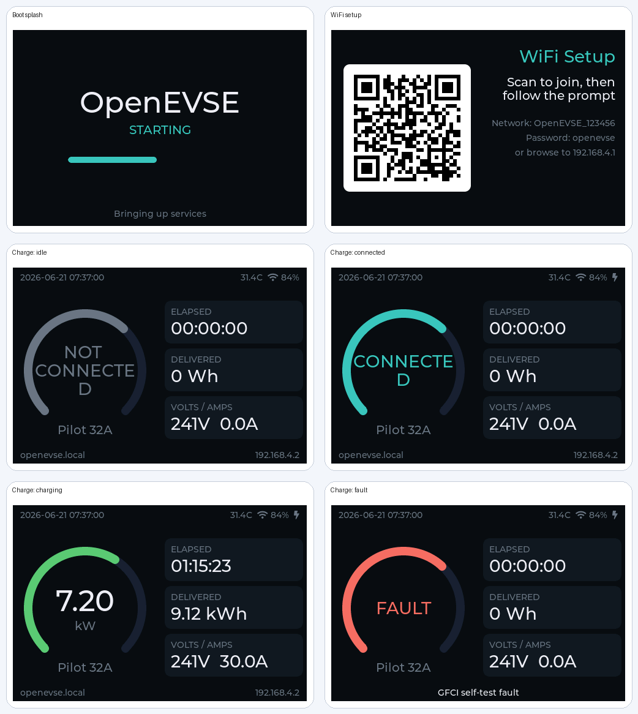

# OpenEVSE Remote Display

A standalone wall or desk display for an OpenEVSE charging station. It runs this
firmware on an inexpensive ESP32-S3 touch panel, connects to your OpenEVSE over
WiFi, and shows live charging status on the same LVGL interface as the official
OpenEVSE TFT — power ring, session energy, daily/lifetime totals, and a dimmed
standby screen.

No wiring to the charger is needed: the display is a pure network client. Put it
anywhere with WiFi coverage — kitchen, hallway, garage wall.

 <!-- same UI as the stock TFT -->

## Hardware

| | |
|---|---|
| Board | [Elecrow CrowPanel Advance 3.5"](https://www.elecrow.com/crowpanel-advance-3-5-hmi-esp32-ai-display.html) (V1.3) |
| SoC | ESP32-S3-WROOM-1 (N16R8: 16 MB flash) |
| Panel | 480×320 ILI9488, SPI |
| Touch | GT911 capacitive, I2C |
| Power | USB-C |

The firmware environment is `openevse_remote_display`. Other ILI9488/GT911
panels can be supported by overriding the pin build-flags (see
[Building](#building-from-source)).

## How it works

```
┌───────────────┐   HTTP GET /status every 5 s   ┌──────────────────┐
│ OpenEVSE      │ ◄───────────────────────────── │ Remote display   │
│ station       │ ─────────────────────────────► │ (this firmware)  │
│ (unmodified)  │        JSON status             │ LVGL charge UI   │
└───────────────┘                                └──────────────────┘
```

- The **remote display client** (`src/remote_display_client.cpp`) polls the
  station's standard `/status` HTTP endpoint — the same API the web UI uses —
  and feeds the LVGL screens (`src/lvgl_tft/`) in place of the local RAPI
  controller. The station needs no configuration and no special firmware.
- The station address (`remote_display_host`) accepts an IP or an mDNS
  `.local` name; `.local` names are resolved on the display itself and survive
  DHCP lease changes.
- If nothing fresh has arrived for 30 s the screen degrades to `--` values and
  shows *"No data from …"* rather than stale numbers. The session-elapsed
  counter ticks locally between polls so it doesn't jump.
- **Touch** wakes the display from the dimmed standby screen, exactly like an
  EVSE state change does. The screens themselves are read-only.

## First flash

Grab from the GitHub release assets:

- `openevse_remote_display.bin` — the application
- `bootloader_s3_16mb.bin`, `partitions_s3_16mb.bin` — needed once, for a
  factory-fresh board

```sh
esptool.py --chip esp32s3 write_flash \
  0x0      bootloader_s3_16mb.bin \
  0x8000   partitions_s3_16mb.bin \
  0x10000  openevse_remote_display.bin
```

Subsequent updates go over the air — from the built-in web pages (below) or
`curl -F firmware=@openevse_remote_display.bin http://<display-ip>/update`.

## Setup

The display's web interface is a **permanent setup wizard** — since the device
is only a viewer, those few pages are its entire UI:

1. **Welcome / WiFi** — on first boot the display opens an `openevse-xxxx`
   access point with a QR code on screen; join it and pick your home network.
2. **Time** — timezone + NTP.
3. **Remote Display** — the page that matters: enter the station's IP or
   `.local` name, or just tap **Scan**. The display browses mDNS
   (`_openevse._tcp`) and lists every OpenEVSE it finds; tapping one stores its
   `.local` name. (mDNS doesn't cross subnets/VLANs — use the IP in that case.)
4. **Display** — language, dark/light theme, brightness, standby brightness
   and standby timeout. Changes apply live.
5. **Firmware** — running versions and build environment, plus two update
   paths: upload a `.bin` from the browser, or **Install from GitHub**, which
   lists releases containing a build for this device and lets the display
   download and flash it itself.

There is no Finish button — the wizard is the whole UI, and revisiting
`http://<display-ip>/` always lands back on it.

## Configuration reference

All options live in the standard `/config` API and persist across updates:

| Option | Default | Meaning |
|---|---|---|
| `remote_display_host` | `""` | Station IP or `.local` name to mirror |
| `tft_theme` | `dark` | `dark` (nightshift) or `light` |
| `tft_brightness` | `100` | Active backlight, 10–100 % |
| `tft_standby_brightness` | `15` | Standby backlight, 0–100 % (0 = screen off) |
| `lcd_backlight_timeout` | `600` | Seconds idle before standby, 0 = never |
| `lang` | browser | Web UI language (en/es/fr/hu) |

Device-specific endpoint: `GET /remotedisplay/scan` returns
`[{"name","ip","port"}]` from a ~3 s mDNS browse.

Build-flag tunables: `REMOTE_DISPLAY_POLL_MS` (5000),
`REMOTE_DISPLAY_DATA_VALID_MS` (30000).

## Building from source

```sh
pio run -e openevse_remote_display            # release build
pio run -e openevse_remote_display -t upload  # USB flash
pio run -e openevse_remote_display_dev        # serial debug build
```

The environment composes reusable fragments in `platformio.ini`:

| Fragment | Purpose |
|---|---|
| `elecrow_advance_35_hw_flags` | ILI9488 pins/inversion for the CrowPanel (TFT_eSPI `USER_SETUP_LOADED`) |
| `lvgl_tft_renderer_flags` | The same LVGL renderer (`ENABLE_SCREEN_LVGL_TFT`) as `openevse_wifi_tft_v1` |
| `touch_gt911_flags` | `ENABLE_TOUCH_GT911` + I2C pins (self-contained driver, no extra library) |
| `remote_display_flags` | `ENABLE_REMOTE_DISPLAY_CLIENT` — swaps the data source from EvseManager to HTTP |

**ESP32-S3 gotcha** (already handled, do not remove): `USE_FSPI_PORT` is
required. Without it TFT_eSPI's S3 code resolves its register base to address 0
and the firmware boot-loops with `StoreProhibited` on the first panel write.

### Orientation / other panels

Two flag sets pair up; flip both if the image is upside down on your unit:

| Right-side-up (default) | Upside-down |
|---|---|
| `-D TFT_ROTATION=3` | `-D TFT_ROTATION=1` |
| touch defaults (`SWAP_XY=1 MIRROR_X=1 MIRROR_Y=0`) | `-D TOUCH_GT911_MIRROR_X=0 -D TOUCH_GT911_MIRROR_Y=1` |

For a different ILI9488/GT911 board, copy `elecrow_advance_35_hw_flags` and
`touch_gt911_flags` with your pins into a new env alongside
`remote_display_flags`.

## Troubleshooting

| Symptom | Likely cause |
|---|---|
| Screen shows *"Set remote_display_host…"* | Station not configured yet — wizard page 3 |
| *"No data from …"* | Station unreachable: wrong address, different subnet, or station offline. `.local` names don't resolve across subnets — use the IP |
| Scan finds nothing | mDNS blocked or display on a different subnet/VLAN than the stations |
| Display upside down | Rebuild with the other rotation pairing (table above) |
| Boot loop on a custom build | Missing `USE_FSPI_PORT` (see gotcha above) |
| Serial debug | 115200 baud on the USB-C port (CH340K); use the `_dev` env for verbose output |

## What still runs

This is the full gateway firmware with a different data source — the web
server, OTA, mDNS advertisement and config store all work normally on the
display itself. The EVSE-side subsystems (RAPI, solar divert, OCPP, …) are
simply idle because no controller is attached, and the screens never read from
them in this build.
