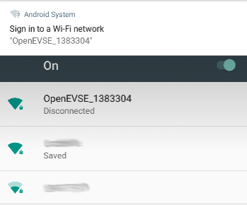
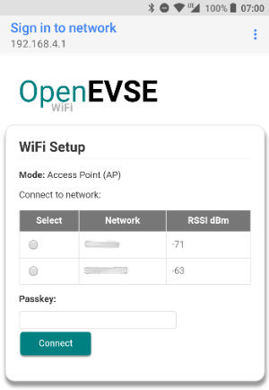
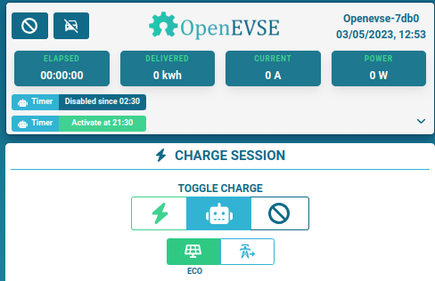
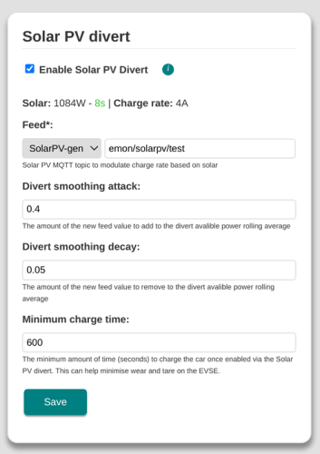
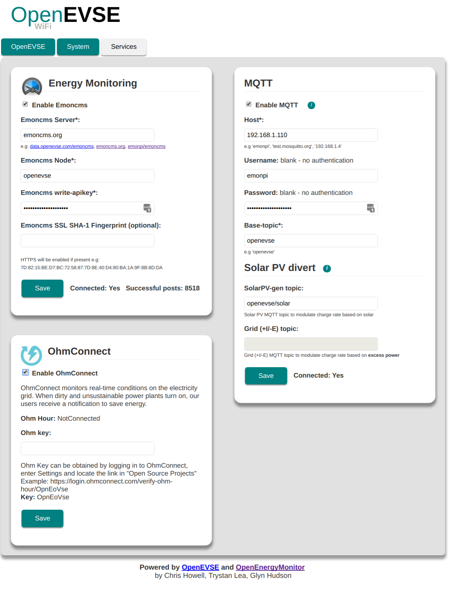

# User Guide

## Contents

<!-- toc -->

- [User Guide](#user-guide)
  - [Contents](#contents)
  - [Hardware](#hardware)
  - [WiFi Hardware](#wifi-hardware)
    - [Temperature sensors](#temperature-sensors)
  - [WiFi Setup](#wifi-setup)
  - [Charging Mode: Eco](#charging-mode-eco)
    - [Eco Mode Setup](#eco-mode-setup)
      - [using MQTT](#using-mqtt)
      - [using HTTP](#using-http)
    - [Eco Mode Advanced Settings](#eco-mode-advanced-settings)
  - [Services](#services)
    - [Emoncms data logging](#emoncms-data-logging)
    - [Current Shaper](#current-shaper)
    - [External values settable from HTTP POST](#external-values-settable-from-http-post)
    - [MQTT](#mqtt)
    - [OhmConnect](#ohmconnect)
  - [System](#system)
    - [Authentication](#authentication)
    - [WiFi Reset](#wifi-reset)
    - [HTTP Auth Password reset](#http-auth-password-reset)
    - [Hardware Factory Reset](#hardware-factory-reset)
  - [Firmware update](#firmware-update)
    - [Via Web Interface](#via-web-interface)
    - [Via Network OTA](#via-network-ota)
    - [Via USB Serial Programmer](#via-usb-serial-programmer)

<!-- tocstop -->

## Hardware

## WiFi Hardware

Most ESP32 boards can be used (see platfromio.ini for full list of supported boards), however the boards which is best supported is the OpenEVSE WiFi V1.

> **Warning**: Be sure to correctly identify your WiFi hardware before updating the firmware


* OpenEVSE V1 - designed for V4.x & V5.x firmware
* [Olimex ESP32 Gateway (Wired Ethernet)](wired-ethernet.md) - can run V4.x and V5.x firmware
* Huzzah ESP32 - can run V4.x and V5.x firmware
* Deprecated: Huzzah ESP8266 - can only run V2.x firmware, see [archive V2.x repository](https://github.com/OpenEVSE/ESP8266_WiFi_v2.x)

### Temperature sensors

* Temp 1 RTC temperature sensor (old LCD module with RTC)
* Temp 2 MCP9808 temperature sensor (new LCD module )
* Temp 3 IR sensor (not used)
* Temp 4 OpenEVSE V1 module 

### Lighting and Indicators

OpenEVSE uses the LCD backlight and/or RGB pixels to indicate status:

* **Off**: Initialising
* OpenEVSE active
  * **Green**: No EV Connected
  * **Yellow**: Connected, but not charging
  * **Cyan/Teal**: Charging
  * **Red**: Fault
* OpenEVSE Sleeping/Disabled
  * **Cyan/Teal**: EV connected
  * **Purple/Violet**: EV disconnected

In addition to this the RGB pixels can be used to indicate the WiFi status on the first pixel:

* **Slow Flashing Yellow**: WiFi AP enabled and waiting for connection
* **Fast Flashing Purple/Violet**: WiFi client connected to AP
* **Slow Flashing Yellow**: Connecting to WiFi network as a client
* **Green**: Connected to WiFi network

## WiFi Setup

At setup OpenEVSE will broadcast a WiFi access point (AP) `OpenEVSE_XXXX`. Connect your browser device to this AP (default password: `openevse`) and the captive portal will forward you to the log-in page. 

Or navigate to [http://192.168.4.1](http://192.168.4.1)





* Select your WiFi network from list of available networks
* Enter WiFi Passkey, then click `Connect`

* OpenEVSE should now connect to local WiFi network
* Re-connect your browsing device to local WiFi network and connect to OpenEVSE using the hostname http://openevse-XXXX.local where XXXX is the ID number of the unit or local IP address.

**If connection / re-connection fails (e.g. network cannot be found or password is incorrect) the OpenEVSE will automatically revert back to WiFi access point (AP) mode after a short while to allow a new network to be re-configured if required. Re-connection to existing network will be attempted every 5 minutes.**

*Holding the `boot / GPIO0` button on the ESP8266 module for about 5s will force WiFi access point mode. This is useful when trying to connect the unit to a new WiFi network. If the unit cannot connect to a WiFi network it will return to AP mode before retrying to connect*

***

## Charging Mode: Eco

'Eco' charge mode allows the OpenEVSE to start/stop and adjust the charging current automatically based on an MQTT feed or received by HTTP POST request ( see below ). This feed could be the amount of solar PV generation or the amount of excess power (grid export). 'Normal' charge mode charges the EV at the maximum rate set.




When Eco Mode is enabled:

* Charging will begin when solar PV gen / grid excess > 1.4kW (6A)
* Charging will pause when solar PV gen / grid excess < 1.4kW (6A)
* Smoothing algorithm is used to avoid rapid state transitions
* Eco Mode is persistent between charging sessions
* Eco Mode can be enabled / disabled via MQTT

A [OpenEnergyMonitor Solar PV Energy Monitor](https://docs.openenergymonitor.org/applications/solar-pv.html) can be used to monitor solar PV system and provide an MQTT feed to the OpenEVSE for 'Eco' mode charging.

### Eco Mode Setup

#### using MQTT
* Enable MQTT Service
* [emonPi MQTT credentials](https://docs.openenergymonitor.org/emoncms/mqtt.html#mqtt) should be pre-populated
* Enter solar PV generation or Grid (+I/-E) MQTT topic e.g. Assuming [standard emonPi Solar PV setup](https://docs.openenergymonitor.org/applications/solar-pv.html), the default MQTT feeds are:
  * Grid Import (positive Import / Negative export*): `emon/emonpi/power1`
  * Solar PV generation (always postive): `emon/emonpi/power2`

#### using HTTP
  * send HTTP POST to http://{openevse_host}/status containing JSON formatted as /status GET endpoint
  * body can contain {"solar": value} or {"grid_ie": value}  in watt.
  
> **Note #1**: 'Grid' feed should include the power consumed by the EVSE
>
> **Note #2**: The EVSE expects the MQTT/HTTP data to update every 5-10s, perforamce will be degraded if the update interval is much faster or slower than this

CT sensor can be physically reversed on the cable to invert the reading.

[MQTT Explorer](http://mqtt-explorer.com/) can be used to view MQTT data. To learn more about MQTT see [MQTT section of OpenEnergyMonitor user guide](https://guide.openenergymonitor.org/technical/mqtt/).

Divertmode can be controlled via mqtt

Topic: `<base-topic>/divertmode/set`
Value: `1` = Normal or `2` = Eco

### Eco Mode Advanced Settings



* Required PV power ratio: specifies which fraction of the EV charging current should come from PV excess. Default value 110% (1.1)
* Divert smoothing attack: controls how quickly the EVSE responds to an increase in solar PV / grid excess. Default value 40% (0.4)
* Divert Smoothing decay: controls how quickly the EVSE responds to a decrease in solar PV / grid excess. Default value 5% (0.05)
* Minimum charge time: the amount of time in seconds the EVSE should run for when triggered by solar PV / grid excess

See this [interactive spreadsheet](https://docs.google.com/spreadsheets/d/1GQEAQ5QNvNuShEsUdcrNsFC12U3pQfcD_NetoIfDoko/edit?usp=sharing) to explore how these values effect the smoothing algorithm.

> **Caution**: adjust these values at your own risk, the default values have been set to minimise wear on the EVSE contactor and the EV chraging system. Rapid switching of the EVSE will result in increased wear on these components

***

## Services



### Emoncms data logging

OpenEVSE can post its status values to [emoncms.org](https://emoncms.org) or any other  Emoncms server (e.g. emonPi) using [Emoncms API](https://emoncms.org/site/api#input). Data will be posted every 30s.

Data can be posted using HTTP or HTTPS.

### Current Shaper

OpenEVSE can shape charge current according to your real time house load, preventing to exceed the maximum power your energy plan can handle.
Once the module is toggled on, it will have highest priority to other claims.
However it's possible to temporary disable it if needed with HTTP or MQTT. For HTTP, send a text/plain HTTP POST request to /shaper with body containing shaper=value

**Note #1**: this service is dependant of an external feed containing the  household live power in watt.
It can come from an MQTT topic or an HTTP POST request.
 *** MQTT ***
 Set the topic in the shaper configuration page ( 'Live power load MQTT Topic' )
 *** HTTP ***
 Send periodically an HTTP POST request to http://{openevse_host}/status containing TEXT formatted like in /status GET endpoint.
Body should contain {"shaper_live_pwr": value} in watt. Can be combined with other settable values.
  
**Note #2**: set 'Max Power Allowed' according to your energy plan.

### External values settable from HTTP POST

If MQTT is not an option, all external data needed can be updated from an HTTP POST request to /status endpoint.

Accepted data:
{
  "voltage": int,          // live voltage in V
  "shaper_live_pwr": int,  // total household live power in W
  "solar": int,            // divert solar production in W
  "grid_ie": int,          // divert grid -import/+export in W
  "battery_level": int,    // vehicle soc in %
  "battery_range": int,    // vehicle range
  "time_to_full_charge"    // vehicle charge ETA
}

### MQTT

Refer to [MQTT API documentation](mqtt.md)


## System

### Authentication

Admin HTTP Authentication (highly recommended) can be enabled by saving admin config by default username and password.

HTTP authentication is required for all HTTP requests including input API

### WiFi Reset

* Hold external button for 10 secs
* Connect to the AP mode WiFi
* Connect to new Wifi network

### HTTP Auth Password reset

* Hold external button for 10 secs
* Connect to the AP mode WiFi
* click the “WiFi Standalone” button
* Set the HTTP auth details again

### Hardware Factory Reset

A Hardware Factory reset (all WiFi and services config lost) can de done via:

* The WiFi interface (press and hold external button for 10's to enable AP mode if required)
* By pressing and holding GPIO0 hardware button (on the WiFi module inside enclosure) for 10s.

> **Note**: Holding the GPIO0 button for 5s will put the WiFi unit into AP (access point) mode to allow the WiFi network to be changed without losing all the service config

## Firmware update

Recomended: Updated directly via the UI 

Advanced: Uploading a firmware release file `.bin`

See [OpenEVSE Wifi releases](https://github.com/OpenEVSE/ESP32_WiFi_v4.x/releases) for latest stable pre-compiled update releases.

'Note: if updating via file upload, be sure to select the correct releas for your hardware.'

### Via Web Interface

This is the easiest way to update. Pre-compiled firmware `.bin` files can be uploaded via the web interface: System > Update.

If for whatever reason the web-interface won't load it's possible to update the firmware via cURL:

```bash
curl -F 'file=@firmware.bin'  http://<IP-ADDRESS>/update && echo
```

### Via Network OTA

The firmware can also be updated via OTA over a local WiFi network using PlatformIO:

```bash
platformio run -t upload --upload-port <IP-ADDRESS>
```

### Via USB Serial Programmer

[Compatiable USB to Serial Programmer](https://shop.openenergymonitor.com/programmer-usb-to-serial-uart/)

On the command line using the [esptool.py utility](https://github.com/espressif/esptool):

If flashing a new ESP32, flashing bootloader and partitions file is required:

```bash
esptool.py --baud 921600 --before default_reset --after hard_reset write_flash -z --flash_mode dio --flash_freq 40m --flash_size detect 0x1000 bootloader.bin 0x8000 partitions.bin 0x10000 firmware.bin
```

Then successive uploads can just upload the firmware

```bash
esptool.py --baud 921600 --before default_reset --after hard_reset write_flash -z --flash_mode dio --flash_freq 40m --flash_size detect 0x10000 firmware.bin
```

**If uploading to a Huzzah ESP32 board, it may be necessary to hold down the GPIO0 button while pressing the Reset button to trigger a download request on the board.  Both buttons can be released after the Reset button has been pressed.**

**If uploading to ESP32 Etherent gateway, use slower baudrate of `115200`**

Or with the [NodeMCU PyFlasher](https://github.com/marcelstoer/nodemcu-pyflasher) GUI, available with pre-built executable files for Windows/Mac.
