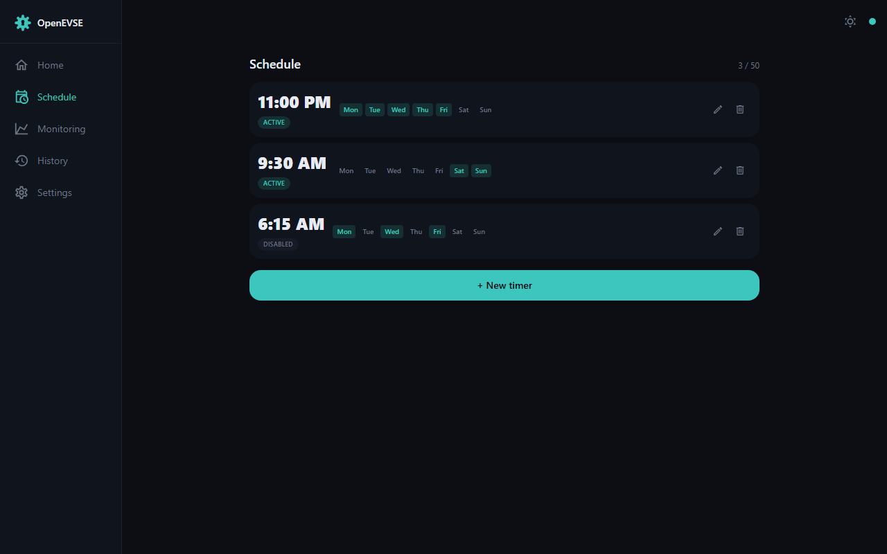

# Charge Manager

One screen for how the station behaves when you're not standing next to it:
the power-up defaults, features that apply to every session, and scheduled
rules — charge on cheap overnight tariffs, require a card tap during the day,
or follow your solar excess on weekends.

## Station defaults

The **Station** card sets the baseline the charger returns to when nothing
else (a schedule, a manual override, OCPP, …) is in control:

- **Current** — the default charge current, adjustable across the full
  hardware range of the unit. Temporary changes for a single session are made
  from the [Dashboard](dashboard.md) rate selector instead.
- The heart icon shows **heartbeat supervision** state (red = active), the
  padlock shows **boot lock** — both are configured via the pencil.

The pencil opens **Default State Settings**:

- **Default state** — whether the charger powers up *active* (ready to
  charge) or *disabled* (must be enabled from the UI first).
- **Heartbeat supervision** — if the WiFi gateway stops talking to the EVSE
  controller, the controller drops to the configured fail current after the
  interval elapses. Setting the interval to 0 disables the feature (same as
  the toggle).
- **Boot lock** — the station won't charge until the WiFi gateway has fully
  booted. Prevents charging with stale settings, at the cost of blocking
  charging entirely if the gateway fails.

## Always active

Features in this section apply to **every** charging session:

- **Temperature protection** — throttle and shutdown setpoints (shown when
  [temperature throttling](safety.md) is enabled).
- **Limit** — stop each session after a set time, energy, state of charge,
  or range.
- **Eco / Solar Divert** — follow available solar power
  (see [Solar divert](solar-divert.md)).
- **Grid Shaping** — keep total draw under your grid connection's limit
  (see [Load shaper](load-shaper.md)).
- **RFID Required** — require a card tap before charging (see [RFID](rfid.md)).
- **OCPP Control** — hand control to your OCPP backend (see [OCPP](ocpp.md)).
- **Charge Current** — pin a fixed current for every session.

**+ Add** enables a feature; the bin removes it (the feature's settings are
kept, so re-adding restores them).

## Scheduled rules

Rules apply an action on a weekly schedule — each has an action (Charge,
Disable, Solar Divert, Grid Shaping, RFID, OCPP), a start time, an optional
stop time, the weekdays it applies to, and an optional per-session limit.

- Rules compile down to the same on-board scheduler as before (up to 50
  timer slots), so they keep working if your WiFi or internet is down —
  time is kept via SNTP; set your timezone under
  [Settings → Time & Date](settings.md#time--date).
- Schedules act at the **Timer/Scheduler** priority: a manual override from
  the [Dashboard](dashboard.md) (On/Off/Boost) wins until it is released,
  after which the schedule resumes control.

A common pattern is a single *Charge* rule spanning your off-peak window
(e.g. 11:00 PM – 6:15 AM, all seven days).

## Claims manager

The bottom of the screen lists the *claims* currently registered on the
charger — which subsystem (manual override, scheduler, divert, OCPP, …) is
asserting control and at what priority. The same view lives on the
[Monitoring](monitoring.md) screen's Manager tab.

## Legacy timers screen

The raw timer list the rules compile into is still available at
`/schedule/legacy` — useful for checking exactly what was written to the
device, or for timer setups made before the Charge Manager existed.
