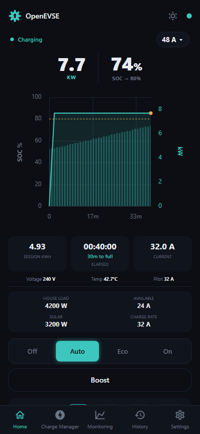

# Dashboard

The home screen shows the live charge state and gives you direct control over
how the charger behaves.

## What you're looking at

- **Power ring / session chart** — live charging power and, when a vehicle
  data source is configured, state of charge over the session.
- **Session stats** — energy delivered this session, elapsed time and time to
  full, current, voltage, EVSE temperature, and pilot.
- **Energy context** — house load, available current, solar generation, and
  the resulting charge rate (shown when solar divert or the load shaper is
  active).
- **Charge current selector** (top right) — the maximum current the EVSE
  offers the vehicle.

Faults are impossible to miss — the ring turns red with the fault name (GFCI
fault, no ground, stuck relay, …):

## Charge modes

The mode pills switch how charging is controlled:

- **Off** — the charger will not charge until switched back.
- **Auto** — the charger follows schedules, limits, and other automation.
- **Eco** — charge from solar excess / grid export
  (see [Solar divert](solar-divert.md)).
- **On** — charge now at the configured rate, overriding schedules.
- **Boost** — temporary full-rate charge (e.g. top up before a trip) that
  yields back to automation afterwards.

Manual overrides register a high-priority *claim* on the charger; automation
(schedules, divert) resumes when the override is released. See
[architecture](../developer/architecture.md#evsemanager-and-the-clientpriority-system)
for how competing claims are arbitrated.

## Session limits

The limit pills below the state-of-charge bar stop the session automatically
at a target: **SOC**, **Range**, **Time**, or **Energy**. The bar shows
progress toward the target (e.g. *74% → 80% · 30m to full*) alongside any
limit imposed by the vehicle itself. A default limit for every session can be
set in the charger settings (`limit_default_type` / `limit_default_value`).

## The dashboard on your phone

The UI is responsive and installable ("Add to Home Screen"):

