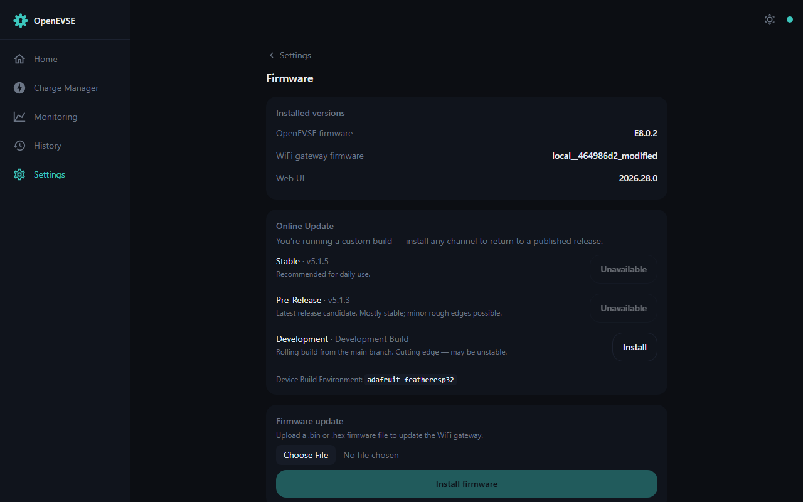

# Firmware update



The Firmware page shows the versions of everything in the box — the EVSE
controller firmware, this WiFi gateway firmware, and the web UI.

## Via the web UI (recommended)

Settings → Firmware can check GitHub for the latest release and update
over-the-air, or accept an uploaded `.bin` release file. Releases are
published at
[github.com/OpenEVSE/openevse_esp32_firmware/releases](https://github.com/OpenEVSE/openevse_esp32_firmware/releases).

> Be sure to pick the correct `.bin` for your hardware (e.g.
> `openevse_wifi_v1.bin` for the standard OpenEVSE WiFi module,
> `olimex_esp32-gateway-e.bin` for the wired-Ethernet gateway).

If the web interface won't load, the same upload works from the command line:

```bash
curl -F 'file=@firmware.bin' http://<IP-ADDRESS>/update && echo
```

## Via network OTA (developers)

```bash
platformio run -t upload --upload-port <IP-ADDRESS>
```

## Via USB serial

Using a [USB-to-serial programmer](https://shop.openenergymonitor.com/programmer-usb-to-serial-uart/)
and [esptool](https://github.com/espressif/esptool). Flashing a factory-fresh
ESP32 needs the bootloader and partition table once:

```bash
esptool.py --baud 921600 --before default_reset --after hard_reset write_flash -z \
  --flash_mode dio --flash_freq 40m --flash_size detect \
  0x1000 bootloader.bin 0x8000 partitions.bin 0x10000 firmware.bin
```

Subsequent uploads only need the firmware:

```bash
esptool.py --baud 921600 --before default_reset --after hard_reset write_flash -z \
  --flash_mode dio --flash_freq 40m --flash_size detect 0x10000 firmware.bin
```

Notes: Huzzah ESP32 boards may need BOOT held while pressing RESET to enter
the bootloader; use 115200 baud for the ESP32 Ethernet gateway. The
[NodeMCU PyFlasher](https://github.com/marcelstoer/nodemcu-pyflasher) GUI is an
alternative with Windows/Mac executables. If the unit reboot-loops after an
update, see [Troubleshooting](troubleshooting.md).
