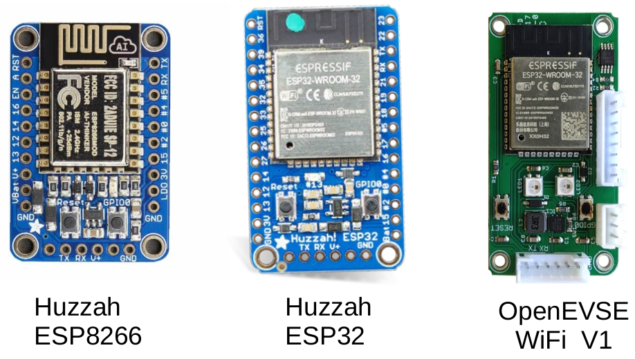
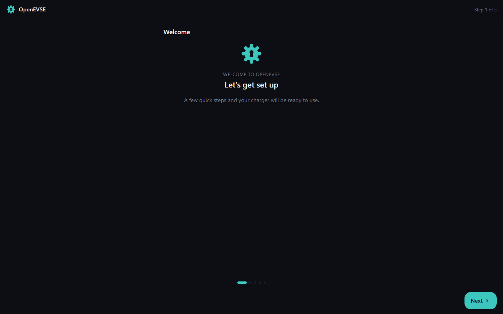

# Getting started

## Supported hardware

Most ESP32 boards can run this firmware (see `platformio.ini` for the full
list); the best-supported board is the **OpenEVSE WiFi V1** module. Wired
Ethernet is supported on the [Olimex ESP32 Gateway](../wired-ethernet.md) and
similar boards.

## WiFi setup

Out of the box (or after a WiFi reset) the unit broadcasts a WiFi access point
named `OpenEVSE_XXXX`:

1. Connect your phone or laptop to that network (default password:
   `openevse`). A captive portal should open automatically — if not, browse to
   [http://192.168.4.1](http://192.168.4.1).
2. Select your home WiFi network from the scan list, enter its passphrase, and
   connect.
3. Re-join your home network and open `http://openevse-XXXX.local` (or the
   unit's IP address).

If the connection fails (wrong password, network out of range), the unit
returns to access-point mode after a short while so you can reconfigure it,
and retries the saved network every 5 minutes. Holding the unit's button for
about 5 seconds forces access-point mode at any time.

## First-run wizard

On first connection the web UI walks you through the basics — charging
current, time zone, and connectivity:

Everything the wizard configures can be changed later under
[Settings](settings.md).

## Status LEDs

The charging-station LCD backlight and/or RGB pixels indicate status:

- **Off** — initialising
- Active: **green** = no EV connected · **yellow** = connected, not charging ·
  **teal** = charging · **red** = fault
- Sleeping/disabled: **teal** = EV connected · **violet** = EV disconnected

The first RGB pixel also shows WiFi status: slow-flashing yellow = access
point waiting / connecting as client · fast-flashing violet = a device is
connected to the access point · green = connected to your network.

## Next steps

- Learn the [Dashboard](dashboard.md) — modes, charge rate, limits
- Set up [charging schedules](schedule.md)
- Have solar? Enable [solar divert](solar-divert.md)
- Connect [Home Assistant or MQTT](integrations.md)
