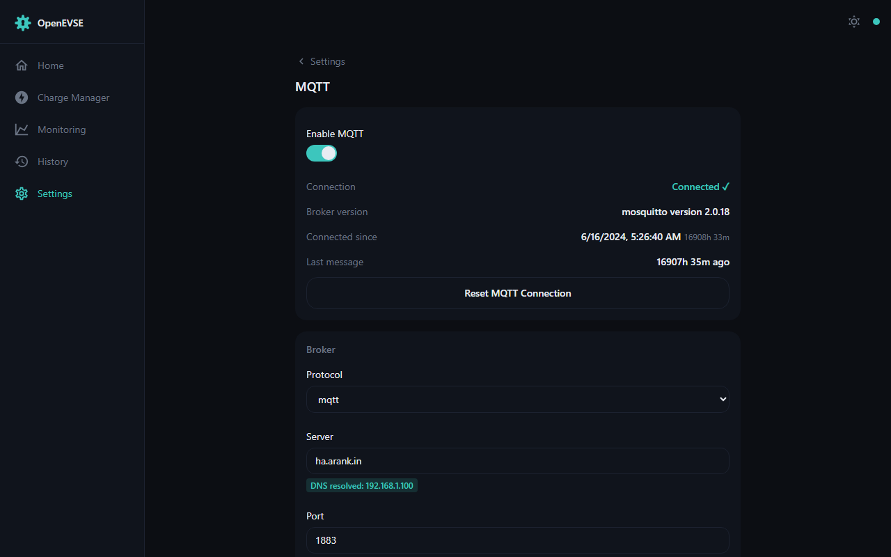
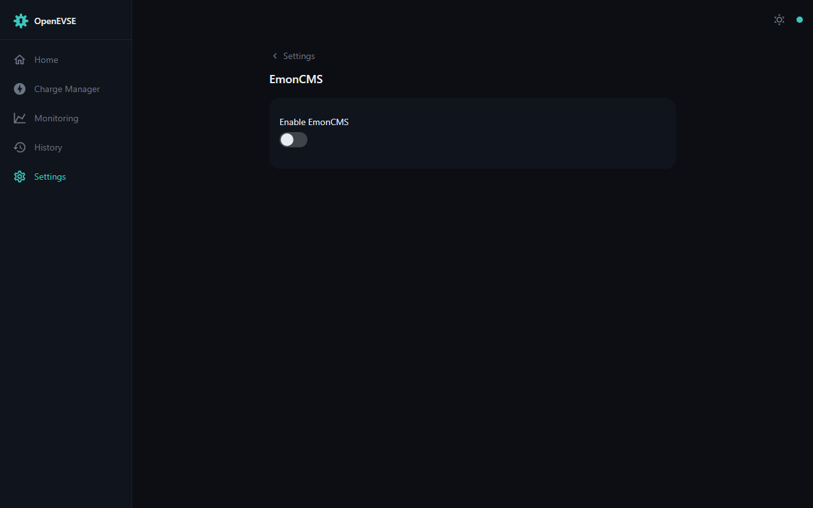
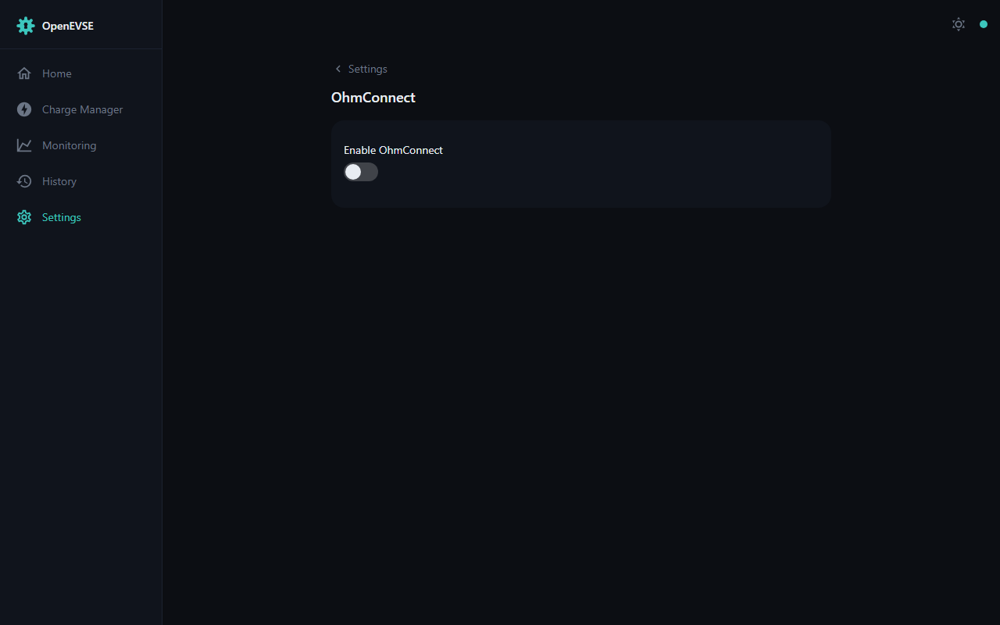

# Integrations — MQTT, Home Assistant, EmonCMS, OhmConnect

## MQTT

MQTT is the primary integration: the charger publishes its full status and
accepts control commands over a broker of your choice (`mqtt://` or `mqtts://`).

Configure the broker address, credentials, and base topic under
Settings → MQTT. The full topic reference is in the
[MQTT API documentation](../mqtt.md) and the
[MQTT developer guide](../Developers_Guide_MQTT.md); the common ones:

- Status is published under `<base-topic>/…` (state, power, session energy,
  temperatures, …) — the announce topic makes devices discoverable.
- Control: `<base-topic>/override/set`, `<base-topic>/charge_rate/set`,
  `<base-topic>/divertmode/set`, and friends.
- Data feeds *into* the charger — solar/grid for
  [divert](solar-divert.md), house load for the [shaper](load-shaper.md),
  vehicle SOC/range for the [dashboard](dashboard.md) — are plain topics you
  point at your existing sensors.

### Home Assistant

The [OpenEVSE integration](https://www.home-assistant.io/integrations/openevse/)
(and the community HACS integration) ride on this MQTT API: point the charger
at the same broker as Home Assistant and entities appear for state, power,
energy, and control. Vehicle SOC from a Home Assistant-connected car can be
fed back to the charger via the `mqtt_vehicle_soc` / `mqtt_vehicle_range`
topics — see [Vehicle](vehicle.md).

## EmonCMS

The charger can post its metrics every 30 s to [emoncms.org](https://emoncms.org)
or a self-hosted EmonCMS/emonPi (HTTP or HTTPS) — long-term, full-resolution
energy logging and dashboards.

## OhmConnect

For OhmConnect participants (California): the charger checks your Ohm Hour
status every 30 seconds and pauses charging during demand-response events.

## Plain HTTP

Everything MQTT can feed in, HTTP can too: POST JSON to the device's `/status`
endpoint with any of `voltage`, `shaper_live_pwr`, `solar`, `grid_ie`,
`battery_level`, `battery_range`, `time_to_full_charge`. The complete HTTP API
is documented at
[openevse.stoplight.io](https://openevse.stoplight.io/docs/openevse-wifi-v4/).
