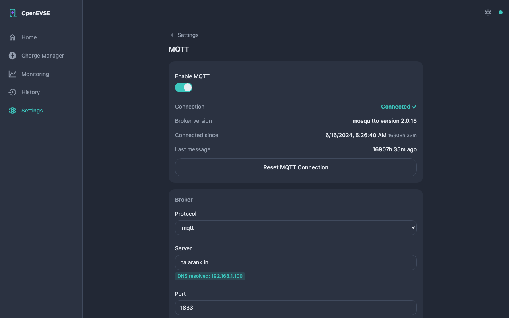
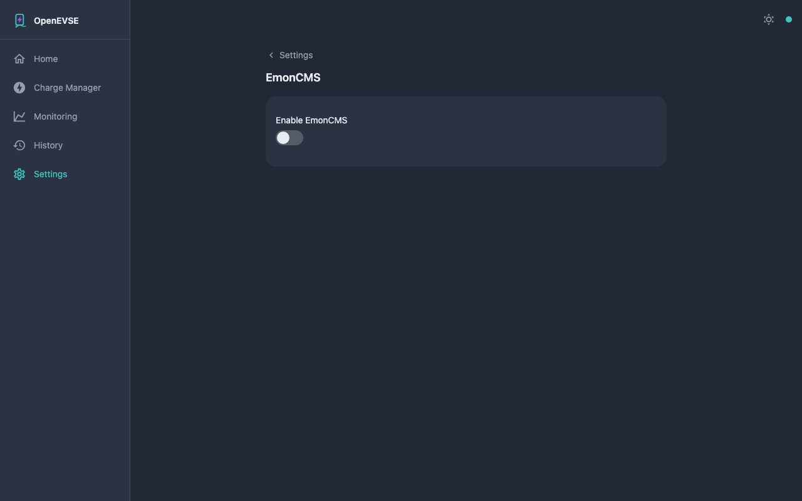

# Integrations — MQTT, Home Assistant, EmonCMS

## MQTT

MQTT is the primary integration: the charger publishes its full status and
accepts control commands over a broker of your choice (`mqtt://` or `mqtts://`).

Configure the broker address, credentials, and base topic under
Settings → MQTT. The full topic reference is in the
[MQTT API documentation](../mqtt.md) and the
[MQTT developer guide](../Developers_Guide_MQTT.md); the common ones:

- Status is published under `<base-topic>/…` (state, power, session energy,
  temperatures, …) — the announce topic makes devices discoverable.
- Control: `<base-topic>/override/set`, `<base-topic>/charge_rate/set`,
  `<base-topic>/divertmode/set`, and friends.
- Data feeds *into* the charger — solar/grid for
  [divert](solar-divert.md), house load for the [shaper](load-shaper.md),
  vehicle SOC/range for the [dashboard](dashboard.md) — are plain topics you
  point at your existing sensors.

### Home Assistant

The [OpenEVSE integration](https://www.home-assistant.io/integrations/openevse/)
(and the community HACS integration) ride on this MQTT API: point the charger
at the same broker as Home Assistant and entities appear for state, power,
energy, and control. Vehicle SOC from a Home Assistant-connected car can be
fed back to the charger via the `mqtt_vehicle_soc` / `mqtt_vehicle_range`
topics — see [Vehicle](vehicle.md).

## EmonCMS

The charger can post its metrics every 30 s to [emoncms.org](https://emoncms.org)
or a self-hosted EmonCMS/emonPi (HTTP or HTTPS) — long-term, full-resolution
energy logging and dashboards.

## Shelly LNM

Shelly Local Network Messaging (LNM) can provide the live grid power and voltage measurements used by OpenEVSE. Configure it from **Settings → Connectivity → Shelly LNM** (`/settings/shellylnm`).

| Option | Default | Description |
|--------|---------|-------------|
| `shelly_lnm_enabled` | `false` | Listen to Shelly LNM messages |
| `shelly_lnm_addr` | `239.255.55.55` | Multicast address, same as configured on the Shelly device |
| `shelly_lnm_port` | `5555` | UDP port, same as configured on the Shelly device |
| `shelly_lnm_device` | empty | Only accept messages from this device ID (e.g. `shellypro3em-8813bfe1ab68`). Empty accepts any device |
| `shelly_lnm_power_field` | `act_power` | JSON field holding the grid power: `act_power` for a Shelly EM / EM Pro / EM Mini, or `total_act_power`, `a_act_power`, `b_act_power`, `c_act_power` for a 3EM (total or per phase) |
| `shelly_lnm_voltage_field` | `voltage` | JSON field holding the voltage: `voltage` for EM / EM Pro / EM Mini, or `a_voltage`, `b_voltage`, `c_voltage` for a 3EM phase |

While enabled, these measurements replace the MQTT inputs for:

* the grid voltage (`mqtt_vrms`);
* the Solar divert grid excess (`mqtt_grid_ie`, grid mode only);
* the Load Shaper live power, unless a dedicated `mqtt_live_pwr` topic (different from `mqtt_grid_ie`) is configured, in which case that MQTT topic keeps feeding the shaper.

The replaced MQTT topics are not subscribed to. Values are applied at most every 5 seconds, and voltage changes below 1 V are ignored. If the Shelly stops sending, the last value is kept (as with MQTT); the Load Shaper has its own data timeout. The listener state, data age, power and voltage are shown live in the Shelly LNM settings.

**Security:** LNM messages are unauthenticated UDP multicast. Anyone on the local network can send packets that set the grid power and voltage seen by OpenEVSE, which is comparable to an unauthenticated MQTT broker. Use `shelly_lnm_device` to ignore other devices' messages, and only enable this on a trusted network.

## Plain HTTP

Everything MQTT can feed in, HTTP can too: POST JSON to the device's `/status`
endpoint with any of `voltage`, `shaper_live_pwr`, `solar`, `grid_ie`,
`battery_level`, `battery_range`, `time_to_full_charge`. The complete HTTP API
is documented at
[openevse.stoplight.io](https://openevse.stoplight.io/docs/openevse-wifi-v4/).
