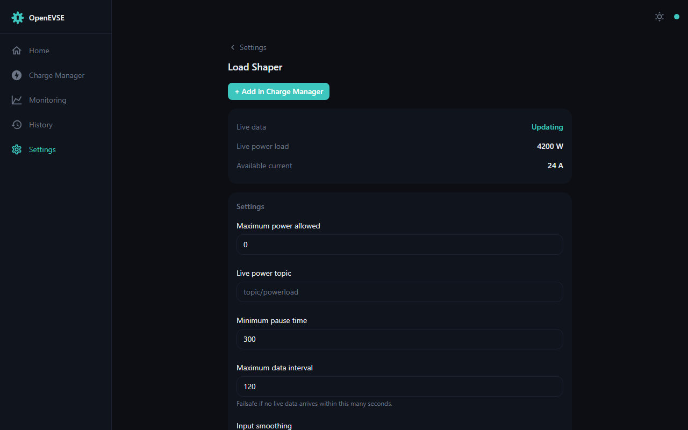

# Load shaper

The current shaper caps total household power draw: it watches your live house
load and reduces the charge current so the total stays under the maximum your
supply (or tariff) allows — no more tripped mains when the oven, heat pump,
and car coincide.

- Set **Max power allowed** to your supply/tariff limit (watts).
- Feed it live household power via **MQTT** (*Live power load MQTT topic*) or
  by POSTing `{"shaper_live_pwr": <watts>}` to the device's `/status`
  endpoint periodically.
- When enabled, the shaper takes a high-priority claim on the charger; it can
  be temporarily disabled over HTTP (`POST /shaper` with `shaper=<value>`) or
  MQTT.
- Smoothing, a minimum pause time, and a data-timeout interval are
  configurable — if the live feed stops arriving, the shaper falls back to a
  safe current.

The [Dashboard](dashboard.md) shows the live house load, the smoothed
available current, and the resulting charge rate whenever the shaper is
active.
