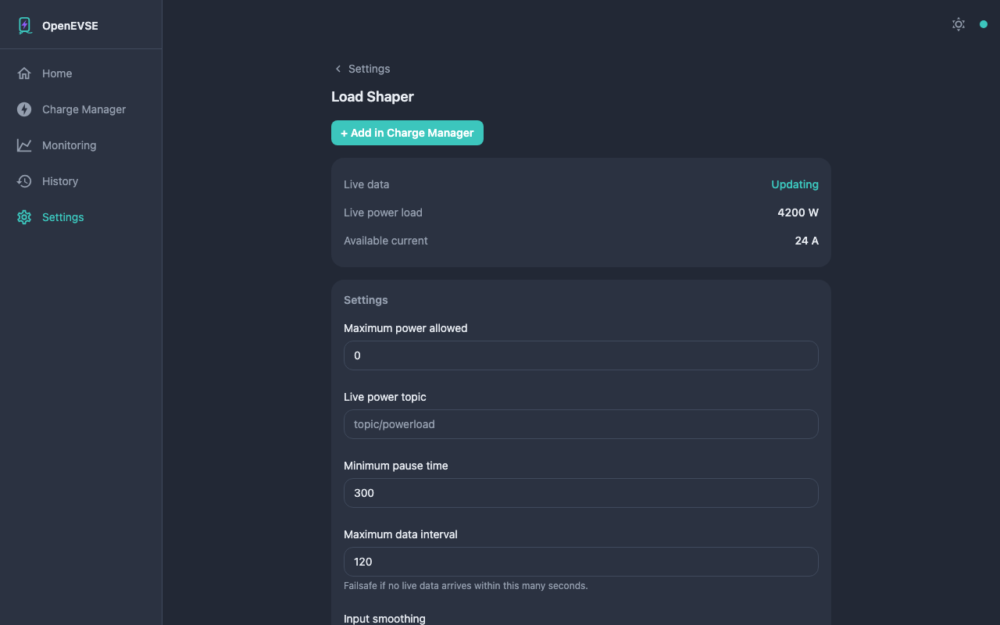

# Load shaper

The current shaper caps total household power draw: it watches your live house
load and reduces the charge current so the total stays under the maximum your
supply (or tariff) allows — no more tripped mains when the oven, heat pump,
and car coincide.

- Set **Max power allowed** to your supply/tariff limit (watts).
- Feed it live household power via **MQTT** (*Live power load MQTT topic*) or
  by POSTing `{"shaper_live_pwr": <watts>}` to the device's `/status`
  endpoint periodically.
- When enabled, the shaper takes a high-priority claim on the charger; it can
  be temporarily disabled over HTTP (`POST /shaper` with `shaper=<value>`) or
  MQTT.
- Smoothing, a minimum pause time, and a data-timeout interval are
  configurable — if the live feed stops arriving, the shaper falls back to a
  safe current.

The [Dashboard](dashboard.md) shows the live house load, the smoothed
available current, and the resulting charge rate whenever the shaper is
active.

## Load sharing between chargers (Labs preview)

Where the shaper caps one charger against the whole house, **load sharing**
splits one supply between several OpenEVSE units: a *controller* keeps the sum
of the group's charge currents under a site limit and hands each *member* an
allocation.

The UI for this ships ahead of the firmware. The page lives at
**Settings → Load Sharing** (`/settings/loadsharing`) and is hidden until you
turn on *Enable Labs features* under
[Settings → Terminal](settings.md) → OpenEVSE Labs; leave it off unless you are
running firmware with load-sharing support built in, otherwise the page has
nothing to talk to.

With matching firmware, the page covers:

- **Settings** — enable, group ID, role (controller or member), site max
  current, safety factor, and the controller host for members.
- **Failsafe** — heartbeat timeout plus what happens when the group goes
  quiet: drop to a safe current, or stop charging.
- **Peer management** — discover units on the network, add or remove them by
  host/IP, set per-peer priority, and see each peer's state, allocation, and
  the reason it was given.

Members surface their assigned limit on the [Dashboard](dashboard.md) alongside
the shaper, since both arrive as claims on the charge current.
