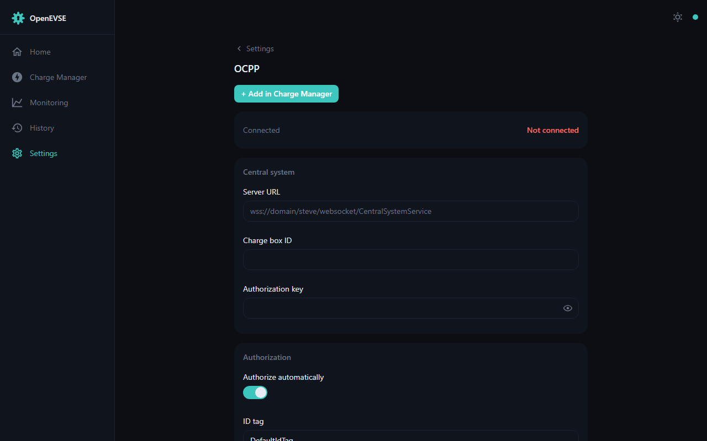

# OCPP

The charger speaks **OCPP 1.6-J** and can register with a charge-point
management system (CSMS) — for fleet management, public charging backends, or
billing platforms.

Under Settings → OCPP:

- **Server** — the CSMS WebSocket URL (`ws://` or `wss://`).
- **Charge box ID** and **authorization key** — the identity the CSMS issued.
- **Default ID tag** and options for automatic authorisation, offline
  authorisation, suspending the EVSE, and energising the plug on approval.

When connected, the CSMS's commands act at OCPP priority — above schedules and
RFID, below the session limit and safety claims (see the
[priority table](../developer/architecture.md#evsemanager-and-the-clientpriority-system)).
OCPP transactions appear in [History](history.md) like any other session.
