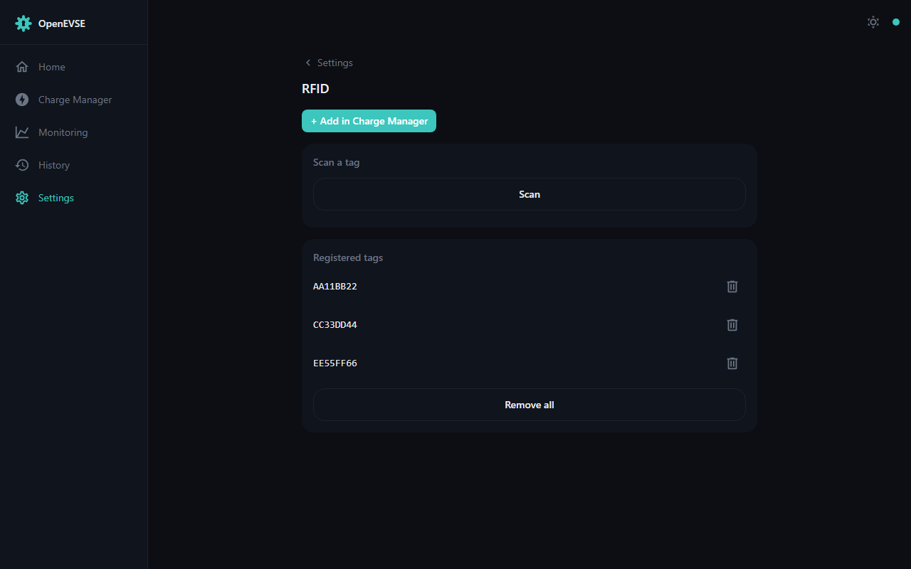

# RFID

With a PN532 NFC module fitted, the charger can require a card/tag scan before
it will charge — useful for shared driveways, workplaces, and multi-tenant
parking.

- Enable RFID under Settings → RFID, then **scan a new card** to register it;
  stored tags can be named so [History](history.md) shows who charged.
- With RFID enabled, the charger stays locked until a registered tag is
  presented; the session is attributed to that tag.
- RFID authorisation acts above manual control but below OCPP in the
  [claim priority order](../developer/architecture.md#evsemanager-and-the-clientpriority-system) —
  a CSMS can still supervise an RFID-enabled charger.
