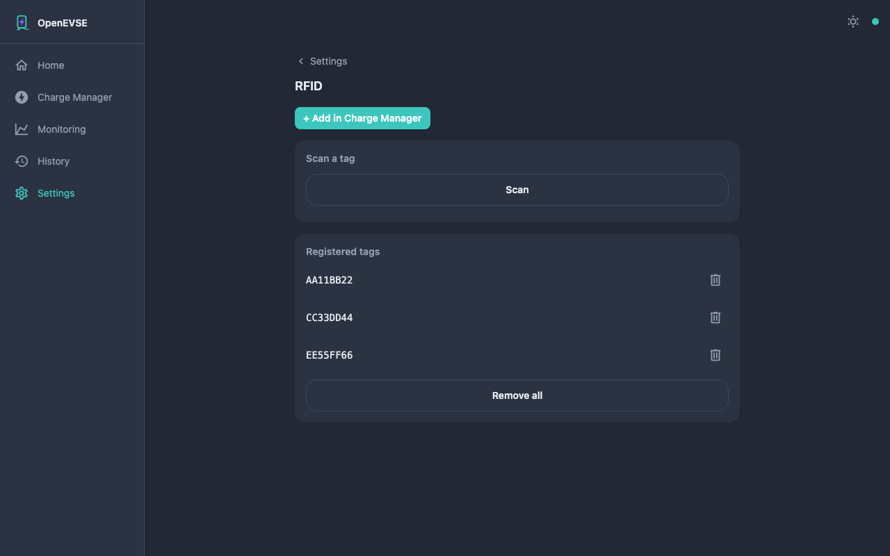

# RFID

With an NFC reader fitted (PN532 on I2C, or MFRC522/RC522 on SPI), the charger
can require a card/tag scan before it will charge — useful for shared driveways,
workplaces, and multi-tenant parking.

Stock `openevse_wifi_v1` builds use the PN532. For RC522, build with
`pio run -e openevse_wifi_v1_rc522` (SPI pins configurable via `RC522_*` build
flags in `platformio.ini`). The stock env defaults `RC522_RST_PIN` to GPIO4 so
RC522 reset does not share GPIO22 (I2C SCL / MCP9808).

- Enable RFID under Settings → RFID, then **scan a new card** to register it;
  stored tags can be named so [History](history.md) shows who charged.
- With RFID enabled, the charger stays locked until a registered tag is
  presented; the session is attributed to that tag.
- RFID authorisation acts above manual control but below OCPP in the
  [claim priority order](../developer/architecture.md#evsemanager-and-the-clientpriority-system) —
  a CSMS can still supervise an RFID-enabled charger.
