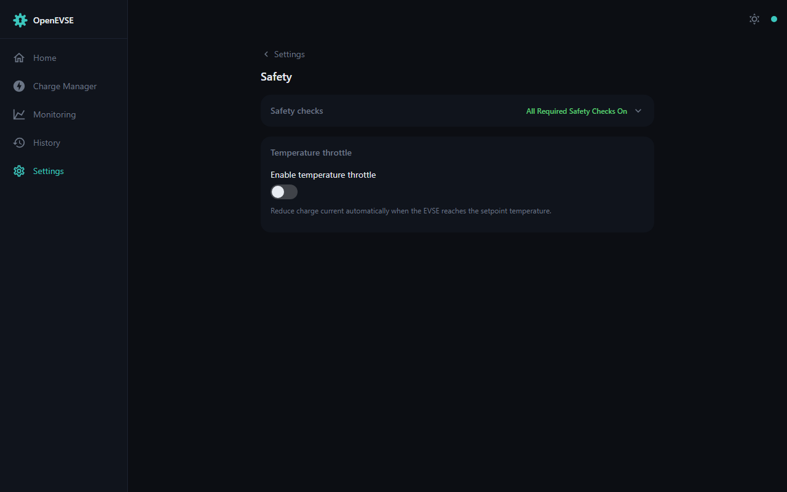

# Safety

## Protection checks

The OpenEVSE controller continuously runs hardware safety checks — diode
check, GFCI self-test, ground monitoring, stuck-relay detection, vent-required
detection, and temperature monitoring. A failed check faults the charger
immediately (red ring on the [Dashboard](dashboard.md), entry in
[History](history.md), counters on
[Monitoring → Safety](monitoring.md)).

The individual checks can be disabled on the Safety page **for diagnostics
only** — a charger with a disabled safety check should never be left in
service. The error claim outranks everything else in the
[priority system](../developer/architecture.md#evsemanager-and-the-clientpriority-system):
nothing can command a faulted charger to charge.

## Temperature throttling

When the EVSE temperature exceeds the throttle setpoint the charge current is
reduced automatically, and charging shuts down entirely at the over-temperature
shutdown threshold. Both thresholds are configurable on the Safety page.

## Boot lock & heartbeat

- **Boot lock** keeps the charger disabled after power-up until the gateway is
  fully online — protecting against a stale controller state after outages.
- The **heartbeat** watchdog reverts the charger to a safe fallback current if
  the WiFi gateway stops responding to the controller (interval and fallback
  current configurable).
