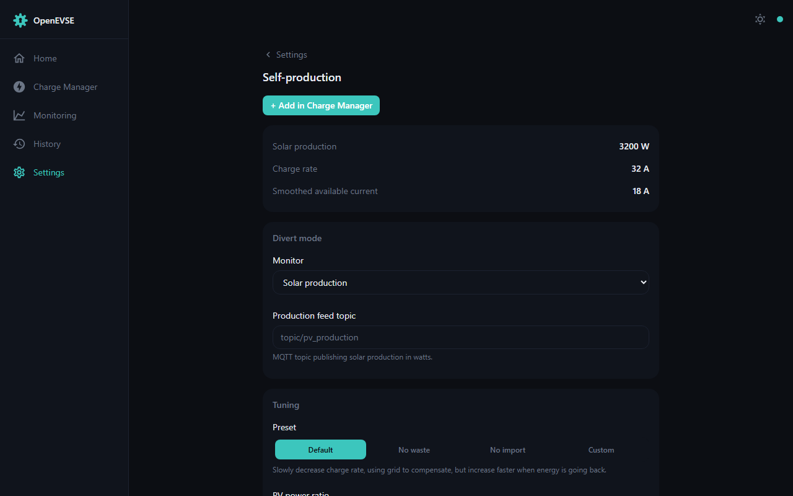

# Solar divert (Eco mode)

Eco mode starts, stops, and modulates charging automatically from a live feed
of your solar generation or grid import/export — so the car charges on power
you'd otherwise export.

## How it behaves

- Charging begins when solar generation / grid excess exceeds the minimum the
  EVSE can deliver (6 A ≈ 1.4 kW at 240 V) and pauses when it drops below.
- A smoothing algorithm damps rapid state transitions to protect the
  contactor and the vehicle's charging system.
- Eco mode persists across charging sessions, and can be toggled from the
  [Dashboard](dashboard.md) mode pills or via MQTT
  (`<base-topic>/divertmode/set`, `1` = Normal, `2` = Eco).

## Feeding it data

Configure **one** of these under Settings → Self-production:

**MQTT** (typical with an
[OpenEnergyMonitor solar PV monitor](https://docs.openenergymonitor.org/applications/solar-pv.html)):
enable the [MQTT service](integrations.md) and set the topic for either

- *Grid import* (positive import / negative export) — e.g. `emon/emonpi/power1`, or
- *Solar generation* (always positive) — e.g. `emon/emonpi/power2`.

**HTTP**: POST JSON to the device's `/status` endpoint containing
`{"solar": <watts>}` or `{"grid_ie": <watts>}`.

Notes:

- The *grid* feed must include the power consumed by the EVSE itself.
- The device expects updates every 5–10 seconds; much faster or slower
  degrades regulation.
- If your grid reading has the wrong sign, physically reverse the CT sensor on
  the cable.

## Advanced settings

- **Required PV power ratio** — the fraction of charge current that must come
  from excess (default 1.1).
- **Divert smoothing attack** — how quickly the charger responds to an
  *increase* in excess (default 0.4).
- **Divert smoothing decay** — how quickly it responds to a *decrease*
  (default 0.05).
- **Minimum charge time** — how long a triggered charge runs at minimum
  (default 600 s), avoiding contactor chatter on passing clouds.

> **Caution**: the defaults minimise wear on the EVSE contactor and the EV's
> charging system. Aggressive values cause rapid switching and increased wear.
> This [interactive spreadsheet](https://docs.google.com/spreadsheets/d/1GQEAQ5QNvNuShEsUdcrNsFC12U3pQfcD_NetoIfDoko/edit?usp=sharing)
> lets you explore the smoothing behaviour.

The algorithm itself is validated by the `divert_sim` simulator in this
repository — see the [developer guide](../developer/building.md#divert_sim-host-build).
