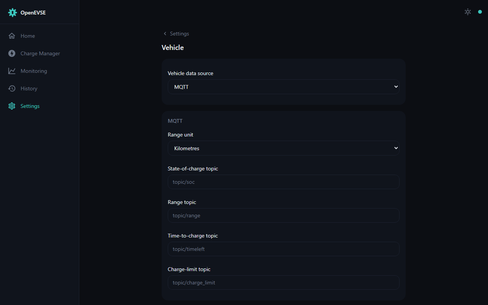

# Vehicle

Give the charger your car's state of charge and the [Dashboard](dashboard.md)
turns from a power meter into a *charging* meter: SOC progress, time to full,
and SOC/range-based [session limits](dashboard.md#session-limits).

Choose a data source under Settings → Vehicle:

- **Tesla** — sign in with your Tesla account and pick the vehicle; the
  charger reads SOC, range, and charge ETA directly.
- **MQTT** — point the SOC / range / ETA / charge-limit topics at any source
  you already have (Home Assistant car integrations, evcc, custom scripts).
- **OCPP** — where the CSMS supplies vehicle data.
- **HTTP** — POST `{"battery_level": <pct>, "battery_range": <km>}` to the
  device's `/status` endpoint.

Range can be reported in miles or kilometres (`mqtt_vehicle_range_miles`).
The home-battery topics (`mqtt_home_battery_soc` / `mqtt_home_battery_power`)
additionally show your house battery on the [Monitoring](monitoring.md) page.
