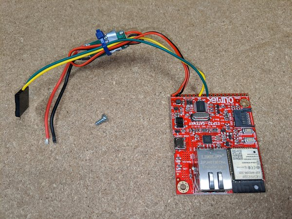
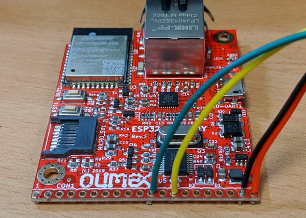
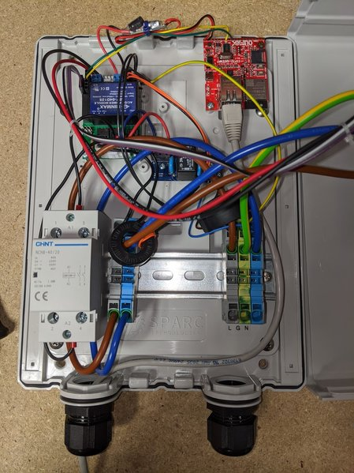
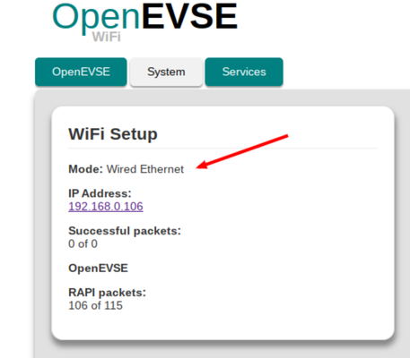

# Wired Ethernet

Several boards are available with ethernet hardware, which can be used as drop-in replacements for ESP8266 / ESP32 WiFi modules and are compatible with all models of OpenEVSE / EmonEVSE.


The ESP32 Gateway (bare board) can be purchased from: https://www.olimex.com/Products/IoT/ESP32/ESP32-GATEWAY/open-source-hardware

It will need to be wired up as follows. 



Network connection can be made with a standard Ethernet cable. For new installations it may be worth considering a power cable with integrated data connections such as the [Doncaster EV-ultra cable](http://www.doncastercables.com/cables/17/77/EV-Ultra/Power-and-data-connectivity-combined-in-one-cable/). If using such a cable, extra work will be required to attach RJ45 connector or socket at each end.

## Hardware Connections

Wiring varies depending on the board in use, in particular [this git issue](https://github.com/OpenEVSE/ESP32_WiFi_V3.x/issues/12) discusses a wiring change between revisions of the ESP32-GATEWAY board.


| Signal     | EVSE wire   | ESP32-GATEWAY E & F | ESP32-GATEWAY pre-E | ESP32-PoE-ISO
| :--------- | :---------- | :------------------ | :------------------ | :------------
| 5V         | Red wire    | 20                  | 20                  | N/C (powered over Ethernet)
| GND        | Black wire  | 19                  | 19                  | GND
| Tx GPIO 32 | Yellow wire | **13**              | **12**              | 33
| Rx GPIO 16 | Green wire  | 11                  | 11                  | 35

See [photos](https://photos.google.com/share/AF1QipNvANgeR_NRmLrq0lhKnA0BR7ieD8DGRoaJFoilMIwQ8c7QpxR4X7hSfGj3XiTTUw) of hardware connectors for new OpenEVSE V5.5 controller.

> **Note**: The these hardware connections apply to the current Rev.E & Rev.F ESP32-gateway hardware revisions. See table above for other units.



The ESP32-gateway can be installed in the EmonEVSE as follows:



## Firmware

ESP32-gateway modules from the OpenEnergyMonitor store come pre-loaded with firmware. Updates to firmware can be made via the web interface.

## Uploading pre-compiled

Pre-compiled FW can be downloaded from the [repo releases page](https://github.com/OpenEVSE/ESP32_WiFi_V3.x/releases/), look for `esp32-gateway-e.bin`

ESP32-gateway can be connected by micro USB and firmware can be uploaded using esptool:

### For rev E

First upload:

```bash
esptool.py --baud 921600 --before default_reset --after hard_reset write_flash -z --flash_mode dio --flash_freq 40m --flash_size detect 0x1000 bootloader.bin 0x8000  partitions.bin 0x10000  olimex_esp32-gateway-e.bin
```

Subsequent upgrades:

```bash
esptool.py --baud 921600 --before default_reset --after hard_reset write_flash -z --flash_mode dio --flash_freq 40m --flash_size detect 0x1000 olimex_esp32-gateway-e.bin
```

*Note: On Ubuntu 22.04 if you notice the ESP gateway is continually disconnect from the USB serail port,check this using `dmesg` then`sudo apt remove brltty` will fix this. This is because there is an ebook reader which shares the same serial adaptor chip as the ESP gateway and the udev rules conflict.*


For Ubuntu 22.04 the simplest solution is to remove the package brltty via sudo apt remove brltty

### For rev F/G

First upload:

```bash
esptool.py --before default_reset --after hard_reset write_flash  0x1000 bootloader.bin 0x8000 partitions.bin 0x10000 olimex_esp32-gateway-f.bin
```

Subsequent upgrades:

```bash
esptool.py --before default_reset --after hard_reset write_flash 0x10000 olimex_esp32-gateway-f.bin`
```

## Compile and Upload

| Board                     | Environment              |
| :------------------------ | :----------------------- |
| ESP32-GATEWAY pre-E       | olimex_esp32-gateway   |
| ESP32-GATEWAY E and later | olimex_esp32-gateway-e |
| ESP32-PoE-ISO             | olimex_esp32-poe-iso   |


Firmware can be compiled using PlatformIO `pio run -e <Environment>`.  The `-t upload` option installs firmware over USB.

```bash
pio run -e olimex_esp32-gateway-e -t upload
```

## Operation

The ESP32-gateway supports both WiFi and Ethernet, if an Ethernet cable is not connected the ESP32-gateway will broadcast a WiFi AP `OpenEVSE_xxx`, connect with Passkey `openevse`.

When an Ethernet cable is connected WiFi will be disabled and the local network IP address and hostname displayed on the LCD.

> **_NOTE:_**  Static IP or custom gateway IP address settings are currently not supported.

The web UI will notify that connection is via Wired Ethernet.



## Feedback

The ESP32-Gateway is a new addition and is currently considered in 'Beta' since the ESP32 firmware is still under active development. However, it has been extensively tested and proven reliable for many months of operation. Please report your experience to the [OpenEnergyMonitor Community Forums](https://community.openenergymonitor.org/).
***
