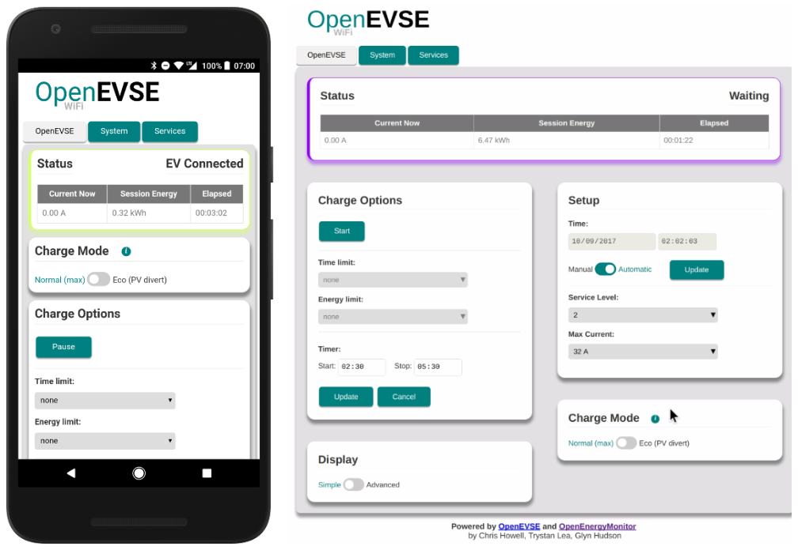

# OpenEVSE WiFi for ESP32

> **_NOTE:_** Breaking change! This release reccomends a minimum of [7.1.3](https://github.com/OpenEVSE/open_evse/releases) of the OpenEVSE firmware, features including Solar Divert and push button menus may not behave as expected on older firmware.

- *For the older WiFi V2.x ESP8266 version (pre June 2020), see the [v2 firmware repository](https://github.com/openevse/ESP8266_WiFi_v2.x/)*

- **For latest API documentation see the new [Spotlight.io OpenEVSE WiFi documentation page](https://openevse.stoplight.io/docs/openevse-wifi-v4/ZG9jOjQyMjE5ODI-open-evse-wi-fi-esp-32-gateway-v4)**

The WiFi gateway uses an **ESP32** which communicates with the OpenEVSE controller via serial RAPI API. The web UI is served directly from the ESP32 web server and can be controlled via a connected device on the local network.

**This FW also supports wired Ethernet connection using [ESP32 Gateway](docs/wired-ethernet.md)**

***

## Contents

<!-- toc -->

- [Features](#features)
- [Requirements](#requirements)
- [User Guide](docs/user-guide.md)
- [Firmware Development Guide](docs/developer-guide.md)
- [API](https://openevse.stoplight.io/docs/openevse-wifi-v4/)
- [About](#about)
- [Licence](#licence)

<!-- tocstop -->

## Features

- Web UI to view & control all OpenEVSE functions
  - Start / pause
  - Scheduler
  - Session & system limits (time, energy, soc, range)
  - Adjust charging current

- MQTT status & control
- Log to Emoncms server e.g [data.openevse.com](https://data.openevse.com) or [emoncms.org](https://emoncms.org)
- 'Eco' mode: automatically adjust charging current based on availability of power from solar PV or grid export
- Shaper: throttle current to prevent overflowing main power capacity 
- OCPP V1.6 (beta)
- [Home Assistant Integration (beta)](https://github.com/firstof9/openevse)

## Requirements

### OpenEVSE / EmonEVSE charging station

- Purchase via: [OpenEVSE Store](https://store.openevse.com)
- OpenEVSE FW [V7.1.3 recommended](https://github.com/OpenEVSE/open_evse/releases)
- All new OpenEVSE units are shipped with V7.1.3 pre-loaded (April 2021 onwards)

### ESP32 WiFi Module

- **Note: WiFi module is included as standard in most OpenEVSE units**
- Purchase via: [OpenEVSE Store (USA/Canda)](https://store.openevse.com/collections/frontpage/products/openevse-wifi-kit) | [OpenEnergyMonitor (UK / EU)](https://shop.openenergymonitor.com/openevse-wifi-gateway/)
- See [OpenEVSE WiFi setup guide](https://openevse.dozuki.com/Guide/WiFi+-+Join+Network/29) for basic instructions

***

## About

Collaboration of [OpenEnegyMonitor](http://openenergymonitor.org) and [OpenEVSE](https://openevse.com).

Contributions by:

- @glynhudson
- @chris1howell
- @trystanlea
- @jeremypoulter
- @sandeen
- @lincomatic
- @joverbee
- @matth-x (OCPP)
- @kipk

## Licence

GNU General Public License (GPL) V3
