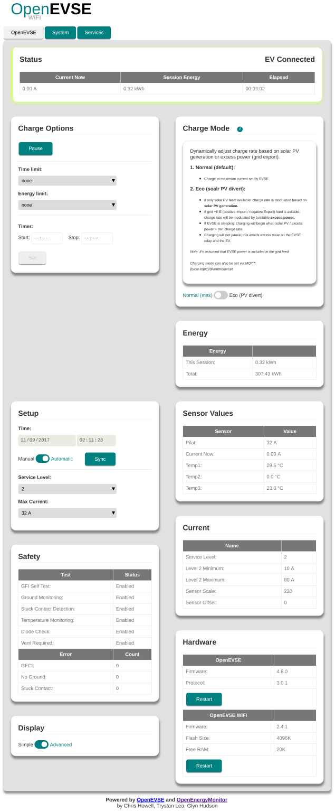
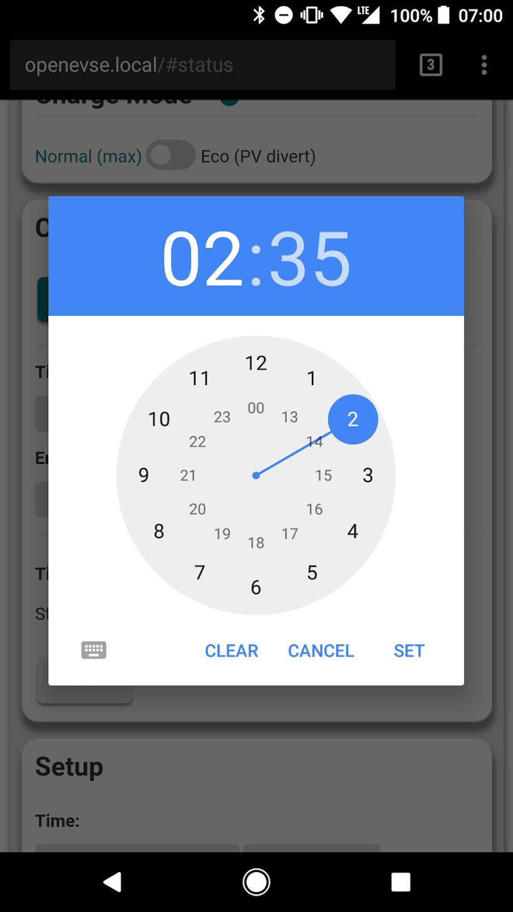
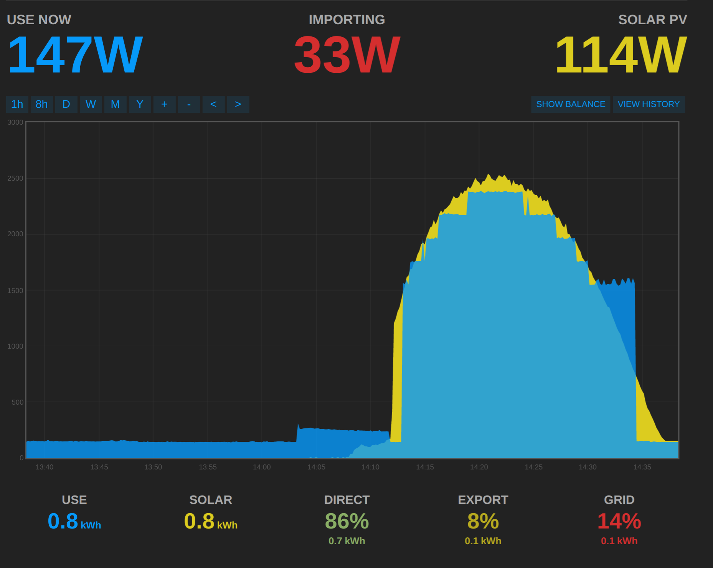
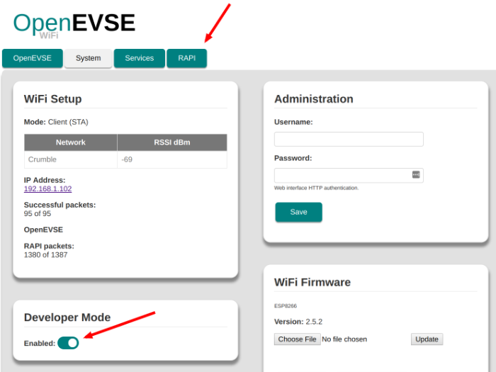
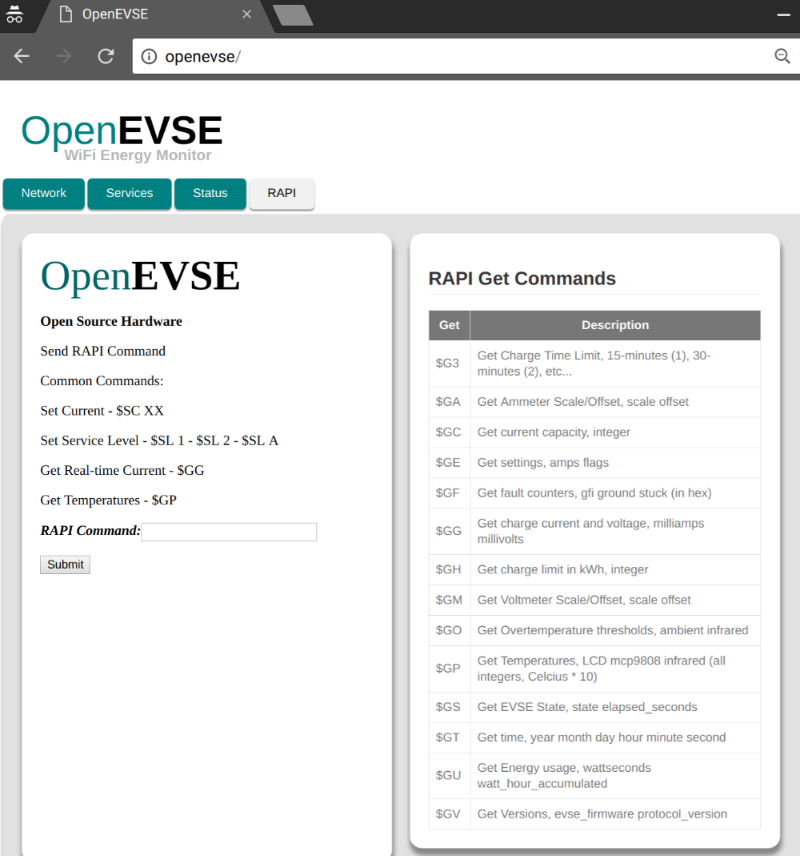
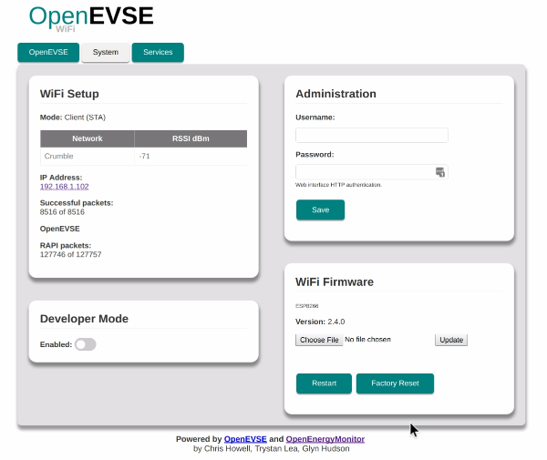

# OpenEVSE WiFi Gateway

[](https://travis-ci.org/OpenEVSE/ESP8266_WiFi_v2.x)
[](https://www.codacy.com/app/jeremy_poulter/ESP8266_WiFi_v2.x?utm_source=github.com&amp;utm_medium=referral&amp;utm_content=jeremypoulter/ESP8266_WiFi_v2.x&amp;utm_campaign=Badge_Grade)


The WiFi gateway uses an ESP8266 (ESP-12) which communicates with the OpenEVSE controller via serial utilizing the existing RAPI API serial interface. The web interface UI is served directly from the ESP8266 web server and can be controlled via a connected device over the network.

Live demo: https://openevse.openenergymonitor.org

## Features

- Web UI to view & control all OpenEVSE functions
  - Start / pause
  - Delay timer
  - Time limit
  - Energy Limit
  - Adjust charging current
- MQTT status & control
- Log to Emoncms server e.g [data.openevse.org](http://data.openevse.org) or [emoncms.org](https://emoncms.org)
- 'Eco' mode: automatically adjust charging current based on availability of power from solar PV or grid export
- OhmConnect integration (California USA only)

## Requirements

### OpenEVSE charging station
  - Purchase via: [OpenEVSE Store (USA/Canda)](https://store.openevse.com) | [OpenEnergyMonitor (UK / EU)](https://shop.openenergymonitor.com/openevse-deluxe-ev-charge-controller-kit/)
  - OpenEVSE FW [V4.8.0+ recommended](https://github.com/OpenEVSE/open_evse/releases)
  - All new OpenEVSE units are shipped with V4.8.0 pre-loaded (October 2017 onwards)
  - OpenEVSE FW V3.10.4 will work with latest WiFi FW with some minor issues e.g. LCD text corruption

### WiFi Module

- ESP8266 (ESP-12) e.g Adafruit Huzzah
- Purchase via: [OpenEVSE Store (USA/Canda)](https://store.openevse.com/collections/frontpage/products/openevse-wifi-kit) | [OpenEnergyMonitor (UK / EU)](http://shop.openenergymonitor.com/openevse-wifi-kit/)
- See [OpenEVSE WiFi setup guide](https://openevse.dozuki.com/Guide/OpenEVSE+WiFi+%28Beta%29/14) for WiFi module connection instructions

***

## Contents

<!-- toc -->

- [User Guide](#user-guide)
  * [WiFi Setup](#wifi-setup)
  * [OpenEVSE Web Interface](#openevse-web-interface)
  * [Charging Mode: Eco](#charging-mode-eco)
    + [Solar PV Divert Example](#solar-pv-divert-example)
    + [Setup](#setup)
    + [Operation](#operation)
  * [Services](#services)
    + [Emoncms data logging](#emoncms-data-logging)
    + [MQTT](#mqtt)
      - [OpenEVSE Status via MQTT](#openevse-status-via-mqtt)
    + [RAPI](#rapi)
      - [RAPI via web interface](#rapi-via-web-interface)
      - [RAPI over MQTT](#rapi-over-mqtt)
      - [RAPI over HTTP](#rapi-over-http)
    + [OhmConnect](#ohmconnect)
  * [System](#system)
    + [Authentication](#authentication)
    + [Firmware update](#firmware-update)
    + [Hardware reset](#hardware-reset)
  * [Firmware Compile & Upload](#firmware-compile--upload)
    + [Using PlatformIO](#using-platformio)
      - [a. Install PlatformIO command line](#a-install-platformio-command-line)
      - [b. And / Or use PlatformIO IDE](#b-and--or-use-platformio-ide)
      - [1. Clone this repo](#1-clone-this-repo)
      - [2. Compile & upload](#2-compile--upload)
    + [Using Arduino IDE](#using-arduino-ide)
      - [1. Install ESP for Arduino with Boards Manager](#1-install-esp-for-arduino-with-boards-manager)
      - [2. Compile and Upload](#2-compile-and-upload)
    + [Troubleshooting Upload](#troubleshooting-upload)
      - [Erase Flash](#erase-flash)
      - [Fully erase ESP](#fully-erase-esp)
  * [About](#about)
  * [Licence](#licence)

<!-- tocstop -->

***

# User Guide

## WiFi Setup

On first boot, OpenEVSE should broadcast a WiFI access point (AP) `OpenEVSE_XXX`. Connect to this AP (default password: `openevse`) and the [captive portal](https://en.wikipedia.org/wiki/Captive_portal) should forward you to the log-in page. If this does not happen navigate to [http://openevse](http://openevse), [http://openevse.local](http://openevse.local) or [http://192.168.4.1](http://192.168.4.1)

*Note: You may need to disable mobile data if connecting via a mobile*

*Note: Use of Internet Explorer 11 or earlier is not recommended*

 


- Select your WiFi network from list of available networks
- Enter WiFi PSK key then click `Connect`

- OpenEVSE should now connect to local WiFi network
- Re-connect device to local WiFi network and connect to OpenEVSE using [http://openevse.local](http://openevse.local), [http://openevse](http://openevse) or local IP address.

**If connection / re-connection fails (e.g. network cannot be found or password is incorrect) the OpenEVSE will automatically revert back to WiFi access point (AP) mode after a short while to allow a new network to be re-configured if required. Re-connection to existing network will be attempted every 5 minutes.**

*Holding the `boot / GPIO0` button on the ESP8266 module for about 5s will force WiFi access point mode. This is useful when trying to connect the unit to a new WiFi network. If the unit cannot connect t0 a WiFi network it will resturn to AP more before retrying to connect*

***

## OpenEVSE Web Interface

All functions of the OpenEVSE can be viewed and controlled via the web interface. Here is a screen grab showing the 'advanced' display mode:



The interface has been optimised to work well for both desktop and mobile. Here is an example setting a charging delay timer using an Android device:



## Charging Mode: Eco

'Eco' charge mode allows the OpenEVSE to adjust the charging current automatically based on an MQTT feed. This feed could be the amount of solar PV generation or the amount of excess power (grid export). 'Normal' charge mode charges the EV at the maximum rate set.

### Solar PV Divert Example

This is best illustrated using an Emoncms MySolar graph. The solar generation is shown in yellow and OpenEVSE power consumption in blue:



- OpenEVSE is initially sleeping with an EV connected
- Once solar PV generation reaches 6A (1.5kW @ 240V) the OpenEVSE initiates charging
- Charging current is adjusted based on available solar PV generation
- Once charging has begun, even if generation drops below 6A, the EV will continue to charge*

**The decision was made not to pause charging if generation current drops below 6A since repeatedly starting / stopping a charge causes excess wear to the OpenEVSE relay contactor.*

If a Grid +I/-E (positive import / negative export) feed was used the OpenEVSE would adjust its charging rate based on *excess* power that would be exported to the grid; for example, if solar PV was producing 4kW and 1kW was being used on-site, the OpenEVSE would charge at 3kW and the amount exported to the grid would be 0kW. If on-site consumption increases to 2kW the OpenEVSE would reduce its charging rate to 2kW.

An [OpenEnergyMonitor solar PV energy monitor](https://guide.openenergymonitor.org/applications/solar-pv/) with an AC-AC voltage sensor adaptor is required to monitor direction of current flow.

### Setup


- To use 'Eco' charging mode MQTT must be enabled and 'Solar PV divert' MQTT topics must be entered.
- Integration with an OpenEnergyMonitor emonPi is straightforward:
  - Connect to emonPi MQTT server, [emonPi MQTT credentials](https://guide.openenergymonitor.org/technical/credentials/#mqtt) should be pre-populated
  - Enter solar PV generation / Grid (+I/-E) MQTT topic e.g. if solar PV is being monitored by emonPi CT channel 1 enter `emon/emonpi/power1`
  - [MQTT lens Chrome extension](https://chrome.google.com/webstore/detail/mqttlens/hemojaaeigabkbcookmlgmdigohjobjm?hl=en) can be used to view MQTT data e.g. subscribe to `emon/#` for all OpenEnergyMonitor MQTT data. To lean more about MQTT see [MQTT section of OpenEnergyMonitor user guide](https://guide.openenergymonitor.org/technical/mqtt/)
  - If using Grid +I/-E (positive import / negative export) MQTT feed ensure the notation positive import / negative export is correct, CT sensor can be physically reversed on the cable to invert the reading.

### Operation

To enable 'Eco' mode charging:

- Connect EV and ensure EV's internal charging timer is switched off
- Pause charge; OpenEVSE should display 'sleeping'
- Enable 'Eco' mode using web interface or via MQTT
- EV will not begin charging when generation / excess current reaches 6A (1.4kW @ 240V)

- During 'Eco' charging changes to charging current are temporary (not saved to EEPROM)
- After an 'Eco mode' charge the OpenEVSE will revert to 'Normal' when EV is disconnected and previous 'Normal' charging current will be reinstated.
- Current is adjusted in 1A increments between 6A* (1.5kW @ 240V) > max charging current (as set in OpenEVSE setup)
- 6A is the lowest supported charging current that SAE J1772 EV charging protocol supports
- The OpenEVSE does not adjust the current itself but rather request that the EV adjusts its charging current by varying the duty cycle of the pilot signal, see [theory of operation](https://openev.freshdesk.com/support/solutions/articles/6000052070-theory-of-operation) and [Basics of SAE J1772](https://openev.freshdesk.com/support/solutions/articles/6000052074-basics-of-sae-j1772).
- Charging mode can be viewed and set via MQTT: `{base-topic}/divertmode/set` (1 = normal, 2 = eco).

\* *OpenEVSE controller firmware [V4.8.0](https://github.com/OpenEVSE/open_evse/releases/tag/v4.8.0) has a bug which restricts the lowest charging current to 10A. The J1772 protocol can go down to 6A. This ~~will~~ has be fixed with a firmware update. See [OpenEnergyMonitor OpenEVSE FW releases](https://github.com/openenergymonitor/open_evse/releases/). A ISP programmer is required to update openevse controler FW.*

***

## Services


### Emoncms data logging

OpenEVSE can post its status values (e.g amp, temp1, temp2, temp3, pilot, status) to [emoncms.org](https://emoncms.org) or any other  Emoncms server (e.g. emonPi) using [Emoncms API](https://emoncms.org/site/api#input). Data will be posted every 30s.

Data can be posted using HTTP or HTTPS. For HTTPS the Emoncms server must support HTTPS (emoncms.org does, the emonPi does not).Due to the limited resources on the ESP the SSL SHA-1 fingerprint for the Emoncms server must be manually entered and regularly updated.

*Note: the emoncms.org fingerprint will change every 90 days when the SSL certificate is renewed.*


### MQTT

#### OpenEVSE Status via MQTT

OpenEVSE can post its status values (e.g. amp, wh, temp1, temp2, temp3, pilot, status) to an MQTT server. Data will be published as a sub-topic of base topic.E.g `<base-topic>/amp`. Data is published to MQTT every 30s.

MQTT setup is pre-populated with OpenEnergyMonitor [emonPi default MQTT server credentials](https://guide.openenergymonitor.org/technical/credentials/#mqtt).

- Enter MQTT server host and base-topic
- (Optional) Enter server authentication details if required
- Click connect
- After a few seconds `Connected: No` should change to `Connected: Yes` if connection is successful. Re-connection will be attempted every 10s. A refresh of the page may be needed.

*Note: `emon/xxxx` should be used as the base-topic if posting to emonPi MQTT server if you want the data to appear in emonPi Emoncms. See [emonPi MQTT docs](https://guide.openenergymonitor.org/technical/mqtt/).*

MQTT can also be used to control the OpenEVSE, see RAPI MQTT below.

### RAPI

RAPI commands can be used to control and check the status of all OpenEVSE functions. RAPI commands can be issued via the direct serial, web-interface, HTTP and MQTT. We recommend using RAPI over MQTT.

**A full list of RAPI commands can be found in the [OpenEVSE plus source code](https://github.com/OpenEVSE/open_evse/blob/stable/firmware/open_evse/src/rapi_proc.h).**

#### RAPI via web interface

Enter RAPI commands directly into to web interface (dev mode must be enabled), RAPI response is printed in return:





#### RAPI over MQTT

RAPI commands can be issued via MQTT messages. The RAPI command should be published to the following MQTT:

`<base-topic>/rapi/in/<$ rapi-command> payload`

e.g assuming base-topic of `openevse` the following command will set current to 13A:

`openevse/rapi/in/$SC 13`

The payload can be left blank if the RAPI command does not require a payload e.g.

`openevse/rapi/in/$GC`

The response from the RAPI command is published by the OpenEVSE back to the same sub-topic and can be received by subscribing to:

`<base-topic>/rapi/out/#`

e.g. `$OK`

[See video demo of RAPI over MQTT](https://www.youtube.com/watch?v=tjCmPpNl-sA&t=101s)

#### RAPI over HTTP

RAPI (rapid API) commands can also be issued directly via a single HTTP request.

*Assuming `192.168.0.108` is the local IP address of the OpenEVSE ESP.*

Eg.the RAPI command to set charging rate to 13A:

[http://192.168.0.108/r?rapi=%24SC+13](http://192.168.0.108/r?rapi=%24SC+13)

To sleep (pause a charge) issue RAPI command `$FS`

[http://192.168.0.108/r?rapi=%24FS](http://192.168.0.108/r?rapi=%24FS)

To enable (start / resume a charge) issue RAPI command `$FE`

[http://192.168.0.108/r?rapi=%24FE](http://192.168.0.108/r?rapi=%24FE)


There is also an [OpenEVSE RAPI command python library](https://github.com/tiramiseb/python-openevse).

### OhmConnect

**USA California only**
[Join here](https://ohm.co/openevse)

**Video - How does it Work**
https://player.vimeo.com/video/119419875

-Sign Up
-Enter Ohm Key

Ohm Key can be obtained by logging in to OhmConnect, enter Settings and locate the link in "Open Source Projects"
Example: https://login.ohmconnect.com/verify-ohm-hour/OpnEoVse
Key: OpnEoVse
## System



### Authentication

Admin HTTP Authentication (highly recommended) can be enabled by saving admin config by default username and password.

**HTTP authentication is required for all HTTP requests including input API**


### Firmware update

Pre-compiled .bin's can be uploaded via the web interface, see [OpenEVSE Wifi releases](https://github.com/OpenEVSE/ESP8266_WiFi_v2.x/releases) for latest updates.

### Hardware reset

A Hardware reset can be made (all wifi and services config lost) by pressing and holding GPIO0 hardware button (on the Huzzah WiFi module) for 10s.

Note: Holding the GPIO0 button for 5s will but the WiFi unit into AP (access point) mode to allow the WiFi network to be changed without loosing all the service config

***

## Firmware Compile & Upload

**The ESP should be shipped with latest firmware pre-installed, firmware can be updated via the HTTP web interface.**

**Updating from V1: it's possible to update from V1 to V2 firmware using the HTTP web interface uploader, just upload the latest .bin pre-compiled firmware release.***

If required firmware can also be uploaded via serial using USB to UART cable.

The code for the ESP8266 can be compiled and uploaded using PlatformIO or Arduino IDE. We recommend PlatformIO for its ease of use.

### Using PlatformIO

For more detailed ESP8266 Arduino core specific PlatfomIO notes see: https://github.com/esp8266/Arduino#using-platformio

#### a. Install PlatformIO command line

The easiest way if running Linux is to install using the install script. See [PlatformIO installation docs](http://docs.platformio.org/en/latest/installation.html#installer-script). Or PlatformIO IDE can be used :

`$ sudo python -c "$(curl -fsSL https://raw.githubusercontent.com/platformio/platformio/master/scripts/get-platformio.py)"`

#### b. And / Or use PlatformIO IDE

Standalone built on GitHub Atom IDE, or use PlatformIO Atom IDE plug-in if you already have Atom installed. The IDE is nice, easy and self-explanatory.

[Download PlatfomIO IDE](http://platformio.org/platformio-ide)

#### 1. Clone this repo

`$ git clone https://github.com/OpenEVSE/ESP8266_WiFi_v2.x`


#### 2. Compile & upload

- Put ESP into bootloader mode
- On other ESP boards (Adafruit HUZZAH) press and hold `boot` button then press `reset`, red LED should light dimly to indicate bootloader mode.

*To enable to OTA upload first upload via serial using the dev environment, this enables to OTA enable build flag. See `platformio.ino*

*Note: uploading SPIFFS is no longer required since web resources are [now embedded in the firmware](https://github.com/OpenEVSE/ESP8266_WiFi_v2.x/pull/87)

***

### Using Arduino IDE

#### 1. Install ESP for Arduino with Boards Manager

From: https://github.com/esp8266/Arduino

Starting with 1.6.4, Arduino allows installation of third-party platform packages using Boards Manager. ESP Arduino packages are available for Windows, Mac OS, and Linux (32 and 64 bit).

- Install Arduino 1.6.8 from the Arduino website.
- Start Arduino and open Preferences window.
- Enter http://arduino.esp8266.com/stable/package_esp8266com_index.json into Additional Board Manager URLs field. You can add multiple URLs, separating them with commas.
- Open Boards Manager from Tools > Board menu and install esp8266 platform (and don't forget to select your ESP8266 board from Tools > Board menu after installation).


#### 2. Compile and Upload

- Open `src.ino` in the Arduino IDE.
- Compile and Upload as normal

***

### Troubleshooting


#### Uploading issues

##### Erase Flash

If you are experiencing ESP hanging in a reboot loop after upload it may be that the ESP flash has remnants of previous code (which may have the used the ESP memory in a different way). The ESP flash can be fully erased using [esptool](https://github.com/themadinventor/esptool). With the unit in bootloader mode run:

`$ esptool.py erase_flash`

*`sudo` maybe be required*

Output:

```
esptool.py v1.2-dev
Connecting...
Running Cesanta flasher stub...
Erasing flash (this may take a while)...
Erase took 8.0 seconds
```

##### Fully erase ESP

To fully erase all memory locations on an ESP-12 (4Mb) we need to upload a blank file to each memory location

`esptool.py write_flash 0x000000 blank_1MB.bin 0x100000 blank_1MB.bin 0x200000 blank_1MB.bin 0x300000 blank_1MB.bin`

#### View serial debug

To help debug it may be useful to enable serial debug output. To do this upload using `openevse_dev` environment e.g.

`pio run -t upload -eopenevse_dev`

The default is to enable serial debug on serial1 the ESP's 2nd serial port. You will need to connect a debugger to the ESP serial1 Tx pin (GPIO2).

To change to use serial0 (the main ESP's serial port) change `-DDEBUG_PORT=Serial1` to `-DDEBUG_PORT=Serial` in `platformio.ini`. Note that using serial 0 will adversely effect RAPI communication with the openevse controller.

***

## About

Collaboration of [OpenEnegyMonitor](http://openenergymonitor.org) and [OpenEVSE](https://openevse.com).

Contributions by:

- @glynhudson
- @chris1howell
- @trystanlea
- @jeremypoulter
- @sandeen
- @lincomatic
- @joverbee

## Licence

GNU General Public License (GPL) V3
