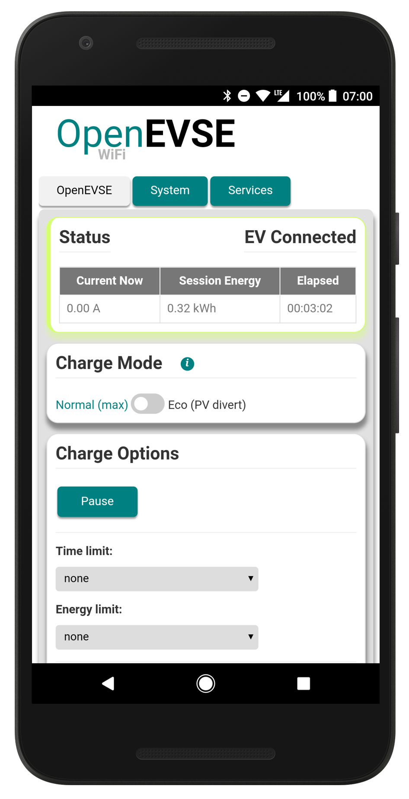
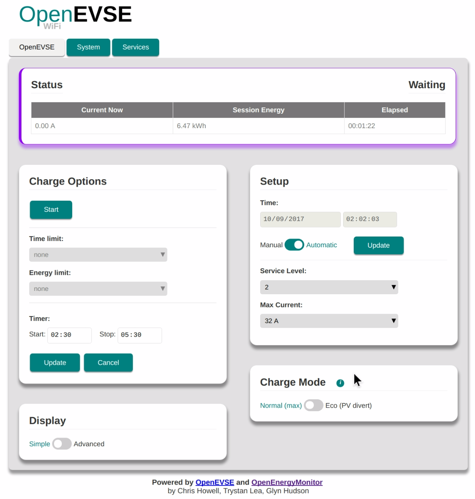

# OpenEVSE WiFi Gateway

[](https://travis-ci.org/jeremypoulter/ESP8266_WiFi_v2.x)
[](https://www.codacy.com/app/jeremy_poulter/ESP8266_WiFi_v2.x?utm_source=github.com&amp;utm_medium=referral&amp;utm_content=jeremypoulter/ESP8266_WiFi_v2.x&amp;utm_campaign=Badge_Grade)






The WiFi gateway uses an ESP8266 (ESP-12) to communcate to the OpenEVSE controller via serial utilizing the existing RAPI serial interface. The web interface is served directly from the ESP8266 and can be controlled via a connected device over a local network.

## Features

- Web UI to view & control all OpenEVSE functions
  - Start / pause
  - Delay timer
  - Time limit
  - Energy Limit
  - Adjust charging current
- MQTT status & control
- Log to Emoncms server e.g [data.openevse.org](http://data.openevse.org) or [emoncms.org](https://emoncms.org)
- 'Eco' mode: automatically adjust charging current based on availability of power from solar PV or grid export
- Ohmconnect integration (California USA only)

***

## Contents

  * [WiFi Setup](#wifi-setup)
  * [OpenEVSE Web Interface](#openevse-web-interface)
  * [Charge Mode (eco)](#charge-mode-eco)
  * [Services](#services)
     * [Emoncms data logging](#emoncms-data-logging)
     * [MQTT](#mqtt)
        * [OpenEVSE Status via MQTT](#openevse-status-via-mqtt)
        * [RAPI](#rapi)
        * [RAPI via web interface](#rapi-via-web-interface)
        * [RAPI over MQTT](#rapi-over-mqtt)
        * [RAPI over HTTP](#rapi-over-http)
     * [Ohmconnect](#ohmconnect)
  * [System](#system)
     * [Authentication](#authentication)
     * [Firmware update](#firmware-update)
  * [Firmware Compile &amp; Upload](#firmware-compile--upload)
     * [Using PlatformIO](#using-platformio)
        * [a. Install PlatformIO command line](#a-install-platformio-command-line)
        * [b. And / Or use PlatformIO IDE](#b-and--or-use-platformio-ide)
        * [1. Clone this repo](#1-clone-this-repo)
        * [2. Compile &amp; upload](#2-compile--upload)
     * [Using Arduino IDE](#using-arduino-ide)
        * [1. Install ESP for Arduino with Boards Manager](#1-install-esp-for-arduino-with-boards-manager)
        * [2. Compile and Upload](#2-compile-and-upload)
     * [Troubleshooting Upload](#troubleshooting-upload)
        * [Erase Flash](#erase-flash)
        * [Fully erase ESP](#fully-erase-esp)
  * [About](#about)
  * [Licence](#licence)


***

# User Guide

## WiFi Setup

On first boot, OpenEVSE should broadcast a WiFI AP `OpenEVSE_XXX`. Connect to this AP (default password: `openevse`) and the [captive portal](https://en.wikipedia.org/wiki/Captive_portal) should forward you to the log-in page. If this does not happen navigate to [http://openevse](http://openevse), [http://openevse.local](http://openevse.local) or [http://192.168.4.1](http://192.168.4.1)

*Note: You may need to disable mobile data if connecting via a Android device*

 


- Select your WiFi network from list of available networks
- Enter WiFi PSK key then click `Connect`

- OpenEVSE should now connect to local wifi network
- Re-connect device to home WiFi network and connect OpenEVSE using [http://openevse.local](http://openevse.local), [http://openevse](http://openevse) or local IP address.

**If connection / re-connection fails (e.g. network cannot be found or password is incorrect) the OpenEVSE will automatically revert back to WiFi access point mode after a short while to allow a new network to be re-configued if required. Re-connection to existing network will be attempted every 5min.**

*Holding the `boot` button on the ESP8266 module at startup (for about 10's) will force Wifi access point mode. This is useful when trying to connect the unit to a new WiFi network.*

***

## OpenEVSE Web Interface

All functions of the OpenEVSE can be viewed and controlled via the web interface. Here is a screen grab showing 'advanecd' display mode:


The interface has been optimised to work well for both desktop and mobile. Here is an example setting a charging delay timer using an Android device:


## Charge Mode (eco)

**TBC**


***

## Services


### Emoncms data logging

OpenEVSE can post its status values (e.g amp, temp1, temp2, temp3, pilot, status) to [emoncms.org](https://emoncms.org) or any other  Emoncms server (e.g. emonPi) using [Emoncms API](https://emoncms.org/site/api#input). Data will be posted every 30s.

Data can be posted using HTTP or HTTPS. For HTTPS the Emoncms server must support HTTPS (emoncms.org does, emonPi does not).Due to the limited resources on the ESP the SSL SHA-1 fingerprint for the Emoncms server must be manually entered and regularly updated.

*Note: the emoncms.org fingerprint will change every 90 days when the SSL certificate is renewed.*


### MQTT

#### OpenEVSE Status via MQTT

OpenEVSE can post its status values (e.g. amp, wh, temp1, temp2, temp3, pilot, status) to an MQTT server. Data will be published as a sub-topic of base topic.E.g `<base-topic>/amp`. Data is published to MQTT every 30s.

- Enter MQTT server host and base-topic
- (Optional) Enter server authentication details if required
- Click connect
- After a few seconds `Connected: No` should change to `Connected: Yes` if connection is successful. Re-connection will be attempted every 10s. A refresh of the page may be needed.

*Note: `emon/xxxx` should be used as the base-topic if posting to emonPi MQTT server if you want the data to appear in emonPi Emoncms. See [emonPi MQTT docs](https://guide.openenergymonitor.org/technical/mqtt/).*

MQTT can also be used to control the OpenEVSE, see RAPI MQTT below.

#### RAPI

RAPI commands can be used to control and check the status of all OpenEVSE functions. A full list of RAPI commands can be found in the [OpenEVSE plus source code](https://github.com/lincomatic/open_evse/blob/stable/rapi_proc.h). RAPI commands can be issued via the web-interface, HTTP and MQTT.

#### RAPI via web interface

Enter RAPI commands directly into to web interface (dev mode must be enabled), RAPI responce is printed in return:

#### RAPI over MQTT

RAPI commands can be issued via MQTT messages. The RAPI command should be published to the following MQTT:

`<base-topic>/rapi/in/<$ rapi-command> payload`

e.g assuming base-topic of `openevse` to following command will set current to 13A:

`openevse/rapi/in/$SC 13`

The payload can be left blank if the RAPI command does not require a payload e.g.

`openevse/rapi/in/$GC`

The responce from the RAPI command is published by the OpenEVSE back to the same sub-topic and can be received by subscribing to:

`<base-topic>/rapi/out/#`

e.g. `$OK`

[See video demo of RAPI over MQTT](https://www.youtube.com/watch?v=tjCmPpNl-sA&t=101s)

#### RAPI over HTTP

RAPI (rapid API) commands can also be issued directly via a single HTTP request.

*Assuming `192.168.0.108` is the local IP address of the OpenEVSE ESP.*

Eg.the RAPI command to set charging rate to 13A:

[http://192.168.0.108/r?rapi=%24SC+13](http://192.168.0.108/r?rapi=%24SC+13)

To sleep (pause a charge) issue RAPI command `$FS`

[http://192.168.0.108/r?rapi=%24FS](http://192.168.0.108/r?rapi=%24FS)

To enable (start / resume a charge) issue RAPI command `$FE`

[http://192.168.0.108/r?rapi=%24FE](http://192.168.0.108/r?rapi=%24FE)


There is also an [OpenEVSE RAPI command python library](https://github.com/tiramiseb/python-openevse).

### Ohmconnect

**TBC**

***

## System


### Authentication

Admin HTTP Authentication (highly recomended) can be enabled by saving admin config by default username and password.

**HTTP authentication is required for all HTTP requests including input API**


### Firmware update

Pre-compiled .bin's can be uploaded via the web interface, see [OpenEVSE Wifi releases](https://github.com/OpenEVSE/ESP8266_WiFi_v2.x/releases) for latest updates.


***

## Firmware Compile & Upload

**The ESP should be shipped with latest firmware pre-installed, firmware can be updated via the HTTP web interface.**

**Updating from V1: it's possible to update from V1 to V2 firmware using the HTTP web interface uploader, just upload the latest .bin pre-compiled firmware release.***

If required firmware can also be uploaded via serial using USB to UART cable.

The code for the ESP8266 can be compiled and uploaded using PlatformIO or Arduino IDE. IMO PlatformIO is the easiest..

### Using PlatformIO

For more detailed ESP8266 Arduino core specific PlatfomIO notes see: https://github.com/esp8266/Arduino#using-platformio

#### a. Install PlatformIO command line

The easiest way if running Linux is to install use the install script, this installed pio via python pip and installs pip if not present. See [PlatformIO installation docs](http://docs.platformio.org/en/latest/installation.html#installer-script). Or PlatformIO IDE can be used :

`$ sudo python -c "$(curl -fsSL https://raw.githubusercontent.com/platformio/platformio/master/scripts/get-platformio.py)"`

#### b. And / Or use PlatformIO IDE

Standalone built on GitHub Atom IDE, or use PlatformIO Atom IDE plug-in if you already have Atom installed. The IDE is nice, easy and self-explanitory.

[Download PlatfomIO IDE](http://platformio.org/platformio-ide)

#### 1. Clone this repo

`$ git clone https://github.com/OpenEVSE/ESP8266_WiFi_v2.x`


#### 2. Compile & upload

- Put ESP into bootloader mode
- On other ESP boards (Adafruit HUZZAH) press and hold `boot` button then press `reset`, red LED should light dimly to indicate bootloader mode.

*To enable to OTA upload first upload via serial using the dev enviroment, this enables to OTA enable build flag. See `platformio.ino*

*Note: uploading SPIFFS is no longet requires since web resources are [now embedded in the firmware](https://github.com/OpenEVSE/ESP8266_WiFi_v2.x/pull/87)

***

### Using Arduino IDE

#### 1. Install ESP for Arduino with Boards Manager

From: https://github.com/esp8266/Arduino

Starting with 1.6.4, Arduino allows installation of third-party platform packages using Boards Manager. ESP Arduino packages are available for Windows, Mac OS, and Linux (32 and 64 bit).

- Install Arduino 1.6.8 from the Arduino website.
- Start Arduino and open Preferences window.
- Enter http://arduino.esp8266.com/stable/package_esp8266com_index.json into Additional Board Manager URLs field. You can add multiple URLs, separating them with commas.
- Open Boards Manager from Tools > Board menu and install esp8266 platform (and don't forget to select your ESP8266 board from Tools > Board menu after installation).


#### 2. Compile and Upload

- Open `src.ino` in the Arduino IDE.
- Compile and Upload as normal

***

### Troubleshooting Upload

#### Erase Flash

If you are experiancing ESP hanging in a reboot loop after upload it may be that the ESP flash has remnants of previous code (which may have the used the ESP memory in a different way). The ESP flash can be fully erased using [esptool](https://github.com/themadinventor/esptool). With the unit in bootloder mode run:

`$ esptool.py erase_flash`

*`sudo` maybe be required*

Output:

```
esptool.py v1.2-dev
Connecting...
Running Cesanta flasher stub...
Erasing flash (this may take a while)...
Erase took 8.0 seconds
```

#### Fully erase ESP

To fully erase all memory locations on an ESP-12 (4Mb) we neeed to upload a blank file to each memory location

`esptool.py write_flash 0x000000 blank_1MB.bin 0x100000 blank_1MB.bin 0x200000 blank_1MB.bin 0x300000 blank_1MB.bin`

***

## About

Collaboration of [OpenEnegyMonitor](http://openenergymonitor.org) and [OpenEVSE](https://openevse.com).

Contributions by:
- @glynhudson
- @chris1howell
- @trystanlea
- @jeremypoulter
- @sandeen
- @lincomatic

## Licence

GNU General Public License (GPL) V3
