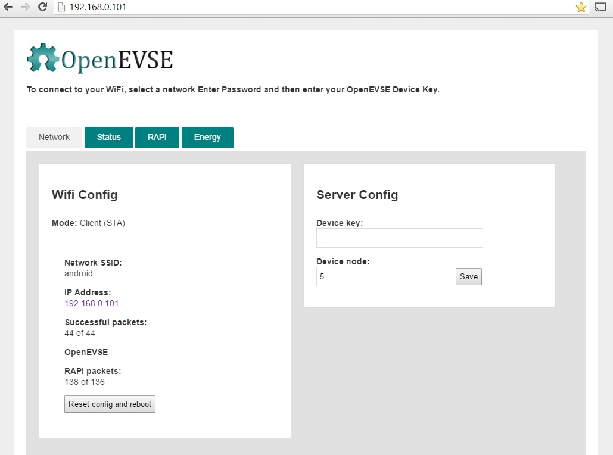

# OpenEVSE WiFi

OpenEVSE ESP8266 WIFI serial to EmonCMS link

### Installation

#### 1. Install ESP for Arduino with Boards Manager

From: https://github.com/esp8266/Arduino

Starting with 1.6.4, Arduino allows installation of third-party platform packages using Boards Manager. ESP Arduino packages are available for Windows, Mac OS, and Linux (32 and 64 bit).

- Install Arduino 1.6.8 from the Arduino website.
- Start Arduino and open Preferences window.
- Enter http://arduino.esp8266.com/stable/package_esp8266com_index.json into Additional Board Manager URLs field. You can add multiple URLs, separating them with commas.
- Open Boards Manager from Tools > Board menu and install esp8266 platform (and don't forget to select your ESP8266 board from Tools > Board menu after installation).

#### 2. Install ESP filesystem file uploader

From: https://github.com/esp8266/Arduino/blob/master/doc/filesystem.md

- Download the tool: https://github.com/esp8266/arduino-esp8266fs-plugin/releases/download/0.2.0/ESP8266FS-0.2.0.zip.
- In your Arduino sketchbook directory, create tools directory if it doesn't exist yet
- Unpack the tool into tools directory (the path will look like <home_dir>/Arduino/tools/ESP8266FS/tool/esp8266fs.jar)
- Restart Arduino

#### 3. Compile and Upload

- Open EmonESP.ino in the Arduino IDE.
- Compile and Upload as normal
- Upload home.html web page using the ESP8266 Sketch Data Upload tool under Arduino tools.

### Licence

GNU General Public License