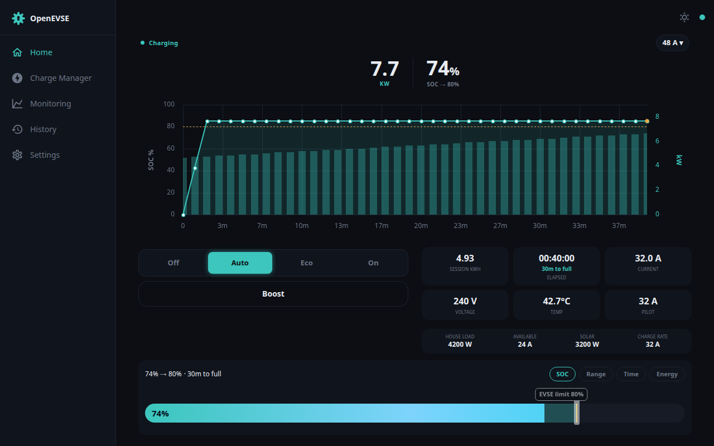
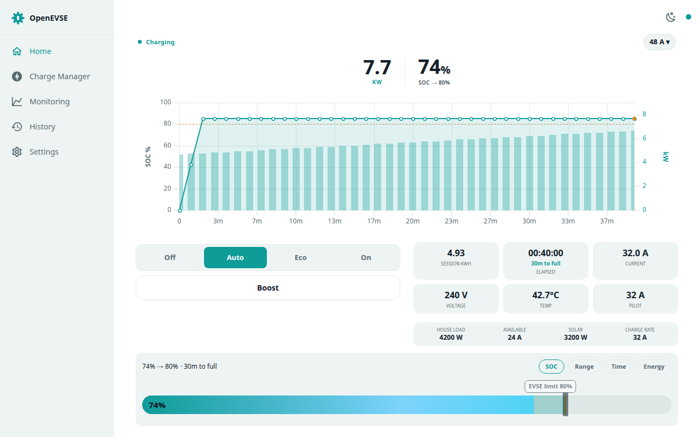

# OpenEVSE WiFi for ESP32

>  This release recommends [9.0.0](https://github.com/OpenEVSE/open_evse/releases). minimum of [7.1.3](https://github.com/OpenEVSE/open_evse/releases) of the OpenEVSE firmware, features including Solar Divert and push button menus may not behave as expected on older firmware.

- *For the older WiFi V2.x ESP8266 version (pre June 2020), see the [v2 firmware repository](https://github.com/openevse/ESP8266_WiFi_v2.x/)*

<table>
  <tr>
    <td width="50%"> <a href="docs/user/dashboard.md">Dashboard</a> — charging (dark theme)</td>
    <td width="50%"> <a href="docs/user/dashboard.md">Dashboard</a> — charging (light theme)</td>
  </tr>
</table>

*Screenshots of every screen — [auto-generated](docs/developer/gui-development.md#screenshots) and always current — illustrate the [user guide](docs/user/index.md).*

The WiFi gateway uses an **ESP32** which communicates with the OpenEVSE controller via serial RAPI API. The web UI is served directly from the ESP32 web server and can be controlled via a connected device on the local network.

***

## Contents

<!-- toc -->

- [Features](#features)
- [Requirements](#requirements)
- [Documentation](#documentation)
  - [User Guide](docs/user/index.md)
  - [Developer Guide](docs/developer/index.md)
  - [AI / coding-agent docs](docs/ai/)
- [Licence](#licence)

<!-- tocstop -->

## Features

- Web UI to view & control all OpenEVSE functions
  - [Start / pause and charge modes](docs/user/dashboard.md)
  - [Scheduler](docs/user/schedule.md)
  - [Session & system limits](docs/user/dashboard.md#session-limits) (time, energy, soc, range)
  - Adjust charging current
  - [Monitoring](docs/user/monitoring.md) and [charge history](docs/user/history.md)

- [MQTT status & control](docs/user/integrations.md)
- Log to Emoncms server e.g [data.openevse.com](https://data.openevse.com) or [emoncms.org](https://emoncms.org)
- ['Eco' mode](docs/user/solar-divert.md): automatically adjust charging current based on availability of power from solar PV or grid export
- [Shaper](docs/user/load-shaper.md): throttle current to prevent overflowing main power capacity
- [OCPP V1.6](docs/user/ocpp.md) (beta)
- [RFID authorisation](docs/user/rfid.md) and [vehicle SOC/range display](docs/user/vehicle.md)
- [Home Assistant Integration (beta)](https://github.com/firstof9/openevse)

## Requirements

### OpenEVSE based Safety/ESP32 WiFi

- Purchase via: [OpenEVSE Store](https://store.openevse.com)
- OpenEVSE FW [V9.0.0 recommended](https://github.com/OpenEVSE/open_evse/releases)
- All new OpenEVSE units are shipped with 9.0.0 pre-loaded (July 2026 onwards)

***

## Documentation

Documentation is organised by audience — start at the
[documentation index](docs/index.md).

### [User Guide](docs/user/index.md)

One page per screen of the web UI, illustrated with auto-generated
screenshots: [getting started](docs/user/getting-started.md) (WiFi setup,
first-run wizard), [dashboard](docs/user/dashboard.md),
[schedule](docs/user/schedule.md), [monitoring](docs/user/monitoring.md),
[history](docs/user/history.md), [solar divert](docs/user/solar-divert.md),
[load shaper](docs/user/load-shaper.md),
[integrations](docs/user/integrations.md) (MQTT, Home Assistant, EmonCMS),
[OCPP](docs/user/ocpp.md), [RFID](docs/user/rfid.md),
[vehicle](docs/user/vehicle.md), [settings reference](docs/user/settings.md),
[safety](docs/user/safety.md), [firmware update](docs/user/firmware-update.md),
and [troubleshooting & reset](docs/user/troubleshooting.md).

### [Developer Guide](docs/developer/index.md)

[Architecture](docs/developer/architecture.md) (subsystems, EvseManager
priorities, RAPI patterns), [building the firmware](docs/developer/building.md)
(PlatformIO envs, host tests), [web UI development](docs/developer/gui-development.md)
(gui-nightshift, mock mode, automated screenshots), and
[wired Ethernet](docs/wired-ethernet.md).

### API references

[HTTP API](https://openevse.stoplight.io/docs/openevse-wifi-v4/) ·
[MQTT API](docs/mqtt.md) ([developer guide](docs/Developers_Guide_MQTT.md)) ·
[RAPI protocol](docs/rapi.md)

### AI / coding-agent docs

[AGENTS.md](AGENTS.md) (build/test commands, critical workflows),
[invariants](docs/ai/invariants.md), and the
[feature map](docs/ai/feature-map.md) — CI enforces that every config option,
UI route, and API path stays documented.

### Screenshots

Every screenshot in the docs is generated automatically from the web UI
(37 images covering all screens, light/dark themes, desktop and mobile):
browse them in [docs/user/screenshots/](docs/user/screenshots/), or see
[how they're generated](docs/developer/gui-development.md#screenshots).

***

## Licence

GNU General Public License (GPL) V3
